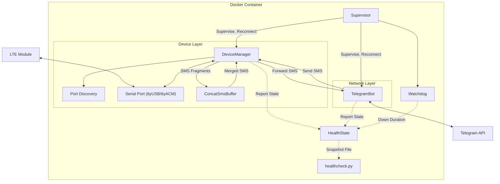

# SMS_forwarder_Telegram (EC200)

This project forwards SMS messages received by GSM/LTE communication modules to a Telegram bot, while also supporting sending SMS through Telegram.

## README
[English](README.md) | [日本語](README_JP.md) | [简体中文](README_CN.md) | [فارسی](README_FA.md)

## Features

- Automatically forwards received SMS to Telegram
- Reply to SMS through Telegram
- **Automatic long SMS merging**: Automatically identifies and merges segmented SMS to ensure complete text reception
- Supports mainstream LTE modules (such as EC200T/EC200S/EC200A series)
- Docker deployment for easy installation and management
- **Automatic port discovery**: finds the modem's AT port itself, so no device path has to be configured
- **Waits for its hardware**: starts before the modem has enumerated and connects as soon as it appears
- **Service health check**: supervision, health reporting and a watchdog keep the service running unattended

## Architecture



`Supervisor` drives two independent components. Each one connects, runs, and is
reconnected with exponential backoff when it fails; neither waits for the other.
A component counts as recovered only once its session has held for
`SERVICE_STABLE_SECONDS`, so a component that connects and immediately fails
still looks broken. `HealthState` records that, the watchdog exits the process if
anything stays down past `WATCHDOG_DOWN_SECONDS`, and `healthcheck.py` reports
the same state to the container runtime.

## Hardware Requirements

- Potentially supported LTE modules (not all verified):
  - EC200T series
  - EC200S series
  - EC200A series
  - EC200N-CN
  - EC600S series
  - EC600N series
  - EC800N series
  - EG912Y-EU
  - EG915N-EU
  - Other GSM/LTE modules supporting AT commands
- USB data cable for connecting the module
- Linux server/computer

## Installation Steps

### 1. Prepare Hardware

1. Insert the SIM card into the LTE module
2. Connect the module to the Linux host via USB data cable

### 2. Confirm Device Recognition

After connecting the module, Linux creates several serial port devices:

```bash
ls -l /dev/ttyUSB*
```

You'll typically see multiple devices (e.g., ttyUSB0, ttyUSB1, ttyUSB2, etc.),
only one of which accepts AT commands. **You do not normally have to work out
which one**: the service probes them at startup and keeps the one that answers.
See [Serial port selection](#serial-port-selection).

The listing is still worth reading for one reason: the two numbers before the
date are the device's major and minor numbers. The major decides which
`device_cgroup_rules` entry the container needs, and both of the usual ones
(188 for `ttyUSB*`, 166 for `ttyACM*`) are already in the example compose file.

### 3. Avoid Device Conflicts

Some system services may occupy the module's serial port. Ensure the port is available:

```bash
# Check if any services are using the serial port
lsof /dev/ttyUSB*

# Disable services that might interfere (such as ModemManager)
sudo systemctl stop ModemManager
sudo systemctl disable ModemManager
```

This matters more than it looks: port discovery opens candidates exclusively and
skips any port another process is holding, so a modem manager sitting on the AT
port makes the modem invisible to this service.

### 4. Create a Private Telegram Bot

1. In Telegram, chat with [@BotFather](https://t.me/botfather) to create a new bot
2. Follow the guide to complete the creation process and obtain the bot TOKEN
3. Get your Telegram user ID (CHAT_ID):
   - Chat with [@userinfobot](https://t.me/userinfobot) to obtain it
   - Or get it through other methods for the bot to send messages

For detailed tutorial, refer to the [Telegram Bot API documentation](https://core.telegram.org/bots/api)

### 5. Configure the Project

1. Pull the Docker image. The `latest` image supports `linux/amd64` and `linux/arm64`:

```bash
docker pull vxhorse/sms-forwarder
```

Or build it from this repository instead, which is the usual choice if you have
just cloned it:

```bash
docker build -t sms-forwarder .
```

If you build it, set `image: sms-forwarder` in your `docker-compose.yml`.

2. Create local configuration files from the sanitized templates:

```bash
cp .env.example .env
cp docker-compose.example.yml docker-compose.yml
```

3. Edit `.env` for your environment.

Only two settings have to be changed:
- `BOT_TOKEN`: Replace with your Telegram bot Token
- `CHAT_ID`: Replace with your Telegram user ID

Everything else has a working default:
- `SMS_PORT`: leave empty unless discovery picks the wrong device — see
  [Serial port selection](#serial-port-selection)
- `PROXY_URL`: leave empty to reach the Telegram API directly; set it to your
  proxy (for example `http://127.0.0.1:7890`) if you need one
- The compose file needs no device path in it at all — see
  [Why not `devices:`](#why-not-devices)

### 6. Start the Service

```bash
docker compose up -d
```

Check that it came up:

```bash
docker compose ps          # health goes from starting to healthy
docker compose logs -f     # follow the startup sequence
```

The container reports `starting` for up to three minutes, which is expected.
[Reading the health check](#reading-the-health-check) explains what each health
state means and how to inspect it.

## Configuration

### Environment variables

Every setting is read from the environment, and every one has a default. A
working `.env` only needs `BOT_TOKEN` and `CHAT_ID`. Durations are in seconds.

| Variable | Default | Purpose |
| --- | --- | --- |
| `LOG_LEVEL` | `INFO` | Logging verbosity |
| `SMS_PORT` | *(empty)* | Modem AT port. Empty means discover it |
| `SMS_BAUDRATE` | `115200` | Serial speed |
| `SMS_DEV_ROOT` | `/dev` | Device tree to scan. The compose file sets `/hostdev` |
| `PORT_PROBE_TIMEOUT` | `3.0` | How long a candidate port has to answer `AT` |
| `BOT_TOKEN` | *(placeholder)* | Telegram bot token |
| `CHAT_ID` | *(placeholder)* | Telegram chat that receives forwarded SMS |
| `PROXY_URL` | *(empty)* | Outbound proxy for the Telegram API. Empty means direct |
| `NOTIFY_TIMEOUT` | `5.0` | Deadline for one state notification. Clamped to 1–10 |
| `RECONNECT_BACKOFF_MIN` | `1.0` | Shortest wait between reconnection attempts |
| `RECONNECT_BACKOFF_MAX` | `30.0` | Longest wait between reconnection attempts |
| `SERVICE_STABLE_SECONDS` | `60.0` | How long a session must hold to count as recovered. Floored at 5 |
| `MODEM_PROBE_INTERVAL` | `30.0` | Liveness probe interval. Clamped to half of `HEALTH_STALE_SECONDS` |
| `MODEM_PROBE_TIMEOUT` | `5.0` | How long the modem has to answer a probe |
| `MODEM_PROBE_FAILURES` | `3` | Consecutive missed probes that force a reconnect |
| `AT_COMMAND_TIMEOUT` | `3.0` | Deadline for one AT command |
| `AT_SLOW_COMMAND_TIMEOUT` | `10.0` | Deadline for slow commands (`AT&F`, `AT+CFUN`, `AT&W`) |
| `HEALTH_FILE` | `/tmp/healthy` | Snapshot file the healthcheck reads |
| `HEALTH_STALE_SECONDS` | `120` | How old that snapshot may be. Floored at 2 |
| `WATCHDOG_DOWN_SECONDS` | `3600` | Exit once a component has been down this long |
| `WATCHDOG_CHECK_INTERVAL` | `30.0` | How often the watchdog looks. Floored at 1 |

### Serial port selection

`SMS_PORT` can be left empty. On startup the service scans for candidate
serial ports and keeps the first one that answers `AT` with `OK`:

1. `$SMS_DEV_ROOT/serial/by-id/*` — stable identifiers, tried first
2. `$SMS_DEV_ROOT/ttyUSB*`
3. `$SMS_DEV_ROOT/ttyACM*`

Built-in serial ports (`ttyS*`) are never probed, because on many boards
`ttyS0` is the kernel console.

This matters because modules of this class expose several serial ports and
only one of them accepts AT commands. Set `SMS_PORT` explicitly only if you
have more than one modem, or if your device is somewhere unusual.

If you do set it, name the path as the service sees it. Under the compose file
in this repository the host's `/dev` is mounted at `/hostdev`, so the port is
`/hostdev/ttyUSB2`, not `/dev/ttyUSB2`.

### Why not `devices:`

The compose file bind-mounts `/dev` and grants access through
`device_cgroup_rules` instead of using a `devices:` mapping.

A `devices:` entry is resolved when the container is **created**. If the
device is not present at that moment, creation fails, the container never
enters the running state, and the restart policy never applies — a restart
policy only covers containers that ran and then exited. On a machine that
boots quickly, the container runtime can easily start before a USB modem has
finished enumerating, and the container then stays down until someone starts
it by hand.

With a bind mount, container creation no longer depends on the device. A
device that appears later shows up inside the container automatically, and
the service waits for it with exponential backoff.

If your modem is not a USB serial device (major 188) but CDC-ACM (major 166),
both are already allowed. Check with `ls -l /dev/ttyUSB*` or `ls -l /dev/ttyACM*`.

### Reading the health check

`healthcheck.py` answers one question — can this process forward a message right
now — and two things have to hold for the answer to be yes:

1. The snapshot file at `HEALTH_FILE` was written less than
   `HEALTH_STALE_SECONDS` ago, which shows the process is still running its
   loops.
2. Every component recorded in that file is up, which shows it can reach both
   the modem and the Telegram API.

The file is only written while every component is up, and each component
rewrites it from its own loop, so a process that has stopped running stops
refreshing it and the file it left behind goes stale. Freshness alone is never
taken as health, and neither is the file merely existing.

Ask the container runtime what it currently thinks:

```bash
docker inspect --format '{{.State.Health.Status}}' sms-forwarder
docker inspect --format '{{json .State.Health.Log}}' sms-forwarder
```

Or run the same check by hand and read its exit code — `0` healthy, `1`
unhealthy:

```bash
docker compose exec sms-forwarder python /app/healthcheck.py; echo $?
```

Three states are worth recognising:

- **`starting`** — inside `start_period`, which the example compose file sets to
  180s. A component is only reported up once its session has held for
  `SERVICE_STABLE_SECONDS` (60s by default), and the snapshot is not written
  until every component is up, so the earliest possible first write is a minute
  after both have connected. `start_period` has to cover that plus however long
  the modem takes to enumerate; raise it if yours is slow.
- **`unhealthy`** — nothing is being forwarded. Note that this does not restart
  anything by itself; the container runtime only records it. Recovery comes from
  the service reconnecting on its own, and failing that from the watchdog, which
  exits the process after `WATCHDOG_DOWN_SECONDS` so the restart policy takes
  over.
- **`healthy`** — the snapshot is fresh and every component is up.

## Usage Instructions

Once the service is started, it will automatically monitor incoming SMS and forward them to the configured Telegram conversation.

### Sending SMS via Telegram

In the Telegram bot conversation:

1. Use the `/sendsms` command to start the sending process
2. Enter the target phone number as prompted
3. Enter the SMS content as prompted
4. You'll receive confirmation after the SMS is sent

### View Help

Send `/help` in the Telegram bot conversation to view all available commands.

## Notes

- **Long SMS Support**: This service supports automatic merging of long SMS. Segmented messages will wait up to 60 seconds for all parts to arrive before merging and forwarding
- **Compatibility**: Different module models have varying compatibility; some modules may not support sending and receiving long text messages
- **Stability**: Each component reconnects on its own with exponential backoff, and a watchdog restarts the process if one stays down past `WATCHDOG_DOWN_SECONDS`
- **Serial Port Selection**: Leave `SMS_PORT` empty and let discovery choose. Set it only when discovery picks the wrong device, and give the path under `SMS_DEV_ROOT`
- **Missing hardware is not an error**: with no modem attached, the service waits and retries indefinitely; the container reports unhealthy while it does
- **SIM Card Detection**: Ensure the SIM card is properly inserted and has sufficient balance
- **Network Dependency**: Telegram communication requires a stable network connection
- **Firewall Settings**: Ensure the server allows network connections to the Telegram API

## Troubleshooting

1. **Unable to Send/Receive SMS**:
   - Check the logs for which port was discovered: `docker compose logs | grep -i port`
   - Confirm SIM card status (signal, balance)
   - Check logs: `docker logs sms-forwarder`

2. **Telegram Communication Issues**:
   - Verify TOKEN and CHAT_ID configuration
   - Check network connection and proxy settings
   - Confirm bot permission settings are correct

3. **Module Not Recognized**:
   - Read what discovery reported: `docker compose logs | grep -iE 'candidate|discovered|answered'`.
     `Discovered modem AT port: ...` means it succeeded; `No candidate port
     answered AT` means every candidate was probed and none replied; `No
     candidate serial ports under ...` means there was nothing to probe at all
   - Confirm the host sees the device: `ls -l /dev/ttyUSB*` and `dmesg | grep tty`
   - If the host sees it but the container does not, check that the major number
     in the listing is covered by `device_cgroup_rules`
   - If candidates were probed and none answered, the usual cause is another
     process holding the AT port — see [Avoid Device Conflicts](#3-avoid-device-conflicts)
   - If your module's AT port is neither a `ttyUSB*` nor a `ttyACM*` device it is
     never probed; set `SMS_PORT` explicitly, as the path under `SMS_DEV_ROOT`
   - Nothing has to be restarted after plugging the module in: the service is
     waiting for it and picks it up on its own

4. **A Module This Project Has Not Been Tested With**:
   - Two commands in the startup sequence are vendor specific (`AT+QCFG`,
     `AT+QURCCFG`). A module that does not implement them logs
     `... was not acknowledged; continuing setup` and carries on, which is
     harmless
   - Only four commands are mandatory: `AT+CFUN=1`, `AT+CMGF=0`, `AT+CPMS` and
     `AT+CNMI`. `Modem did not acknowledge <command>` followed by a reconnect
     means one of those was refused, and the module cannot be driven as it stands
   - [`doc/README.md`](doc/README.md) maps every command the service issues to
     what it does, so each one can be looked up in your own module's AT manual

5. **The Container Never Becomes Healthy**:
   - `starting` for up to three minutes is expected — see
     [Reading the health check](#reading-the-health-check)
   - Staying `unhealthy` means a component is down, and the log names which:
     `Component <name> failed ...`
   - An unhealthy container is not restarted by the container runtime. The
     watchdog exits the process after `WATCHDOG_DOWN_SECONDS`, and the restart
     policy takes it from there
