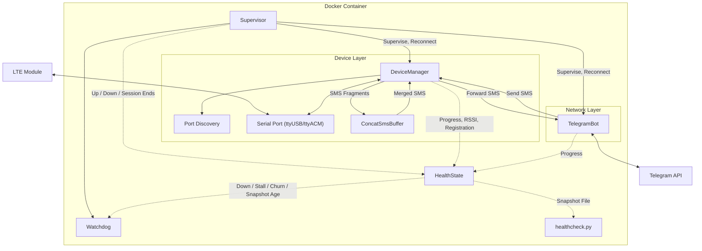

# SMS_forwarder_Telegram (EC200)

This project forwards SMS messages received by GSM/LTE communication modules to a Telegram bot, while also supporting sending SMS through Telegram.

## README
[English](README.md) | [日本語](README_JP.md) | [简体中文](README_CN.md) | [فارسی](README_FA.md)

## Features

- Automatically forwards received SMS to Telegram
- Reply to SMS through Telegram
- **Automatic long SMS merging**: Automatically identifies and merges segmented SMS to ensure complete text reception
- Supports mainstream LTE modules (such as EC200T/EC200S/EC200A series)
- Docker deployment for easy installation and management
- **Automatic port discovery**: finds the modem's AT port itself, so no device path has to be configured
- **Waits for its hardware**: starts before the modem has enumerated and connects as soon as it appears
- **Service health check**: supervision, health reporting and a watchdog keep the service running unattended

## Architecture



`Supervisor` drives two independent components. Each one connects, runs, and is
reconnected with exponential backoff when it fails; neither waits for the other.
A component counts as recovered only once its session has held for
`SERVICE_STABLE_SECONDS`, so a component that connects and immediately fails
still looks broken. `HealthState` records that, the watchdog exits the process on
any of the three ways a component can be lost — down past
`WATCHDOG_DOWN_SECONDS`, still reporting up while its loop has stopped advancing
for `WATCHDOG_STALL_SECONDS`, or ending `WATCHDOG_CHURN_SESSIONS` connected
sessions inside `WATCHDOG_CHURN_WINDOW` — and `healthcheck.py` reports the same
state to the container runtime.

## Hardware Requirements

- Potentially supported LTE modules (not all verified):
  - EC200T series
  - EC200S series
  - EC200A series
  - EC200N-CN
  - EC600S series
  - EC600N series
  - EC800N series
  - EG912Y-EU
  - EG915N-EU
  - Other GSM/LTE modules supporting AT commands
- USB data cable for connecting the module
- Linux server/computer

## Installation Steps

### 1. Prepare Hardware

1. Insert the SIM card into the LTE module
2. Connect the module to the Linux host via USB data cable

### 2. Confirm Device Recognition

After connecting the module, Linux creates several serial port devices:

```bash
ls -l /dev/ttyUSB*
```

You'll typically see multiple devices (e.g., ttyUSB0, ttyUSB1, ttyUSB2, etc.),
only one of which accepts AT commands. **You do not normally have to work out
which one**: the service probes them at startup and keeps the one that answers.
See [Serial port selection](#serial-port-selection).

The listing is still worth reading for one reason: the two numbers before the
date are the device's major and minor numbers. The major decides which
`device_cgroup_rules` entry the container needs, and both of the usual ones
(188 for `ttyUSB*`, 166 for `ttyACM*`) are already in the example compose file.

### 3. Avoid Device Conflicts

Some system services may occupy the module's serial port. Ensure the port is available:

```bash
# Check if any services are using the serial port
lsof /dev/ttyUSB*

# Disable services that might interfere (such as ModemManager)
sudo systemctl stop ModemManager
sudo systemctl disable ModemManager
```

This matters more than it looks: port discovery opens candidates exclusively and
skips any port another process is holding, so a modem manager sitting on the AT
port makes the modem invisible to this service.

### 4. Create a Private Telegram Bot

1. In Telegram, chat with [@BotFather](https://t.me/botfather) to create a new bot
2. Follow the guide to complete the creation process and obtain the bot TOKEN
3. Get your Telegram user ID (CHAT_ID):
   - Chat with [@userinfobot](https://t.me/userinfobot) to obtain it
   - Or obtain it by any other means; it is the chat the bot will send to

For detailed tutorial, refer to the [Telegram Bot API documentation](https://core.telegram.org/bots/api)

### 5. Configure the Project

1. Pull the Docker image. The `latest` image supports `linux/amd64` and `linux/arm64`:

```bash
docker pull vxhorse/sms-forwarder
```

Or build it from this repository instead, which is the usual choice if you have
just cloned it:

```bash
docker build -t sms-forwarder .
```

If you build it, set `image: sms-forwarder` in your `docker-compose.yml`.

2. Create local configuration files from the sanitized templates:

```bash
cp .env.example .env
cp docker-compose.example.yml docker-compose.yml
```

3. Edit `.env` for your environment.

Only two settings have to be changed:
- `BOT_TOKEN`: Replace with your Telegram bot Token
- `CHAT_ID`: Replace with your Telegram user ID

Everything else has a working default:
- `SMS_PORT`: leave empty unless discovery picks the wrong device — see
  [Serial port selection](#serial-port-selection)
- `PROXY_URL`: leave empty to reach the Telegram API directly; set it to your
  proxy (for example `http://127.0.0.1:7890`) if you need one
- The compose file needs no device path in it at all — see
  [Why not `devices:`](#why-not-devices)

### 6. Start the Service

```bash
docker compose up -d
```

Check that it came up:

```bash
docker compose ps          # health goes from starting to healthy
docker compose logs -f     # follow the startup sequence
```

The container reports `starting` for up to three minutes, which is expected.
[Reading the health check](#reading-the-health-check) explains what each health
state means and how to inspect it.

## Configuration

### Environment variables

Every setting is read from the environment, and every one has a default. A
working `.env` only needs `BOT_TOKEN` and `CHAT_ID`. Durations are in seconds.

The **Bounds** column is part of the contract, not a footnote. A setting whose
value would disable the guard it exists for, or reinstate the failure that guard
prevents, is clamped, and the startup log names every setting a bound moved away
from a value you actually set. A derived default that the bounds then move is
not announced — that would be arithmetic nobody asked about on every start — so
a quiet startup means nothing you set was overridden, not that nothing was
clamped. A setting with no ceiling says so and says why, so an absent bound can
never be read as a forgotten one.

| Variable | Default | Purpose | Bounds |
| --- | --- | --- | --- |
| `LOG_LEVEL` | `INFO` | Logging verbosity | None — a level name, not a number. Anything unrecognised falls back to `INFO` |
| `SMS_PORT` | *(empty)* | Modem AT port. Empty means discover it | None — a path |
| `SMS_BAUDRATE` | `115200` | Serial speed | None. A speed the modem does not use shows up as every candidate failing to answer `AT`, which discovery reports as `No candidate port answered AT` — without a port name, since the per-port lines are at DEBUG. Set `LOG_LEVEL=DEBUG` to see which candidates were tried and which stayed silent |
| `SMS_DEV_ROOT` | `/dev` | Device tree to scan. The compose file sets `/hostdev` | None — a path |
| `PORT_PROBE_TIMEOUT` | `3.0` | How long a candidate port has to answer `AT` | Unbounded, deliberately. Discovery runs before any session exists, and waiting for hardware is never something this service cuts short |
| `BOT_TOKEN` | *(placeholder)* | Telegram bot token | None — a credential. Credentials have no bounds and never appear in a startup notice |
| `CHAT_ID` | *(placeholder)* | Telegram chat that receives forwarded SMS | None — a credential, as above |
| `PROXY_URL` | *(empty)* | Outbound proxy for the Telegram API. Empty means direct | None — a URL |
| `NOTIFY_TIMEOUT` | `5.0` | Deadline for one state notification | 1 to the ten-second shutdown budget, which it shares with `SERIAL_CLOSE_TIMEOUT`: both are awaited one after the other on the way out, and together they must not outlast the shortest stop grace period in common use |
| `RECONNECT_BACKOFF_MIN` | `1.0` | Shortest wait between reconnection attempts | Floored at `0.1`: the backoff grows by doubling and zero doubles to zero, so a minimum of zero is not a short first wait but every wait, for ever. Unbounded above — `RECONNECT_BACKOFF_MAX` is floored at whatever this is, so raising it carries the maximum up with it |
| `RECONNECT_BACKOFF_MAX` | `30.0` | Ceiling on the reconnection wait before jitter | Floored at `RECONNECT_BACKOFF_MIN`: a maximum below the minimum makes each retry's wait shrink instead of grow. Each wait is scaled by ±20% of jitter, which is what keeps two components from retrying in lockstep, so the longest one actually taken is a fifth above this figure — 36 seconds as shipped. Unbounded above, deliberately — a longer wait only delays a reconnection, and `WATCHDOG_CHURN_WINDOW`'s floor grows with it so the churn criterion keeps pace |
| `SERVICE_STABLE_SECONDS` | `60.0` | How long a session must hold to count as recovered | Floored at 5: at zero every connection counts as a recovery the instant it is made, which is the one thing this setting exists to prevent. Unbounded above, but not free, and bounded from two directions by relationships rather than by a number. Nothing is marked up until a session has held this long, so this plus `WATCHDOG_CHECK_INTERVAL` has to stay under `WATCHDOG_DOWN_SECONDS`; and only a session judged recovered is counted, so it also has to stay under the fastest failure the probe schedule can raise — `MODEM_PROBE_FAILURES × (MODEM_PROBE_INTERVAL + MODEM_PROBE_TIMEOUT)`, or `MODEM_REGISTRATION_FAILURES × MODEM_PROBE_INTERVAL` where the registration check is on, whichever is smaller; **105 as shipped** against a 60-second window — or that failure stops reaching `WATCHDOG_CHURN_SESSIONS` at all. A startup notice reports either relationship, and names which failure the second one refers to |
| `MODEM_PROBE_INTERVAL` | `30.0` | Liveness probe interval | 1 to half of `HEALTH_STALE_SECONDS` (60 as shipped). The probe is also what refreshes the snapshot, so this loop alone has to be able to keep the file fresh |
| `MODEM_PROBE_TIMEOUT` | `5.0` | How long the modem has to answer a probe | 1 to `(HEALTH_STALE_SECONDS − MODEM_PROBE_FAILURES × MODEM_PROBE_INTERVAL) / (MODEM_PROBE_FAILURES + 1)`, which is **7.5 as shipped**. Raising this is exactly what one does for a slow modem, and past that figure the worst gap between two snapshot refreshes leaves `HEALTH_STALE_SECONDS` and the healthcheck fails a working process |
| `MODEM_PROBE_FAILURES` | `3` | Consecutive missed probes that force a reconnect | Floored at 1: the loop raises once the count reaches this figure, so zero behaves exactly as one while reading like an off switch. Unbounded above, deliberately — more patience only delays a reconnect, and `MODEM_PROBE_TIMEOUT`'s ceiling tightens as this grows |
| `MODEM_REGISTRATION_CHECK` | `0` | Also ask whether the modem is on the network. Off by default — see [The registration check](#the-registration-check) | On or off, not a number. Kept as a separate setting from the count below precisely so that tuning how patient the check is cannot switch it off by accident |
| `MODEM_REGISTRATION_FAILURES` | `3` | Consecutive "not registered" readings that force a reconnect, once the check is on | Floored at 2: registration dips for a moment during a handover, so one reading is evidence of nothing, and zero behaves exactly as one — the session ends once the count reaches this figure — while reading like an off switch, which is what `MODEM_REGISTRATION_CHECK` exists separately to provide. Unbounded above, deliberately — more patience only delays the session ending, and while the check is on `WATCHDOG_CHURN_WINDOW`'s floor is multiplied by this count, so the window keeps pace with the slower cycle it then has to hold |
| `AT_COMMAND_TIMEOUT` | `3.0` | Deadline for one AT command | Unbounded, deliberately. It bounds one command, not the loop; a command that outlasts the liveness probe's own deadline is caught by that probe and the reconnect it forces |
| `AT_SLOW_COMMAND_TIMEOUT` | `10.0` | Deadline for slow commands (`AT&F`, `AT+CFUN`, `AT&W`, and the stored-message listing `AT+CMGL=4`) | Unbounded, deliberately, for the same reason. These commands run during setup, which is a wait this service never puts a ceiling on |
| `SERIAL_CLOSE_TIMEOUT` | `5.0` | How long a serial port has to flush before the close is forced | 1 to whatever `NOTIFY_TIMEOUT` leaves of the same ten-second shutdown budget — the defaults use it exactly, 5 + 5 = 10. Where the floor and that ceiling collide the floor wins and a startup notice says the budget no longer holds |
| `HEALTH_FILE` | `/tmp/healthy` | Snapshot file the healthcheck reads | None — a path. A path that cannot be written is reported rather than restarted for; see [Reading the health check](#reading-the-health-check) |
| `HEALTH_STALE_SECONDS` | `120` | How old that snapshot may be | Floored at 2, because `MODEM_PROBE_INTERVAL` is clamped to half of it but never below 1, so a shorter window would be shorter than the fastest possible refresh. Unbounded above, deliberately — it is the operator's stated tolerance for a stale snapshot, and both probe ceilings are derived from it, so widening it loosens them in step |
| `WATCHDOG_DOWN_SECONDS` | `3600` | Exit once a component has been down this long | Unbounded above, deliberately. It is itself the ceiling on `WATCHDOG_STALL_SECONDS`; set below that setting's derived floor, the floor wins and a startup notice says the invariant no longer holds for that configuration. It has a lower bound in practice too: it must clear `SERVICE_STABLE_SECONDS` plus `WATCHDOG_CHECK_INTERVAL` plus however long your modem takes to connect, or the watchdog exits before any component can reach its first recovery — a permanent restart loop on working hardware. A startup notice reports the part of that sum this file can compute; the connect time is yours to add |
| `WATCHDOG_STALL_SECONDS` | *(derived)* | Exit once a component loop has not advanced for this long while still reporting up | Defaults to twice `HEALTH_STALE_SECONDS`, then floored at a derived figure (**310 as shipped**) and capped at `WATCHDOG_DOWN_SECONDS`, floor applied last. Below the floor the watchdog restarts a process that is merely riding out a slow modem |
| `WATCHDOG_CHECK_INTERVAL` | `30.0` | How often the watchdog looks | Floored at 1: zero turns the watchdog into a busy loop. Unbounded above, deliberately — it is a sampling rate, and every threshold is measured from its own clock rather than from how often this loop samples, so a slower watchdog delays a restart instead of missing one |
| `WATCHDOG_CHURN_SESSIONS` | `10` | Exit once one component has ended this many connected sessions inside the window below | Floored at 2: one reconnection is not a pattern, and at zero or one a single transient failure ends the process. Unbounded above, deliberately — a higher threshold only makes the criterion less eager, and `WATCHDOG_CHURN_WINDOW`'s floor is multiplied by it, so the window cannot fall behind the count it has to hold |
| `WATCHDOG_CHURN_WINDOW` | `1800.0` | The window those sessions are counted in | Floored at `WATCHDOG_CHURN_SESSIONS × (RECONNECT_BACKOFF_MAX + the worst time a component can take to raise)`, which is **1400 as shipped** and **3600 with `MODEM_REGISTRATION_CHECK=1`**. The backoff term is the setting rather than the wait actually taken, which jitter puts up to a fifth higher, so the floor is a close approximation of the slowest cycle rather than a bound on it. Below the floor the count can never reach the threshold and the criterion is switched off while looking enabled — a floor against a false negative, unlike every other one here. **Unbounded above, deliberately**: widening it only makes the criterion more eager, in proportion to what was asked for, and no value of it disables a guard or reinstates a failure, which is what every ceiling in this table exists to prevent |

Any bound written above as a formula, or as another setting's name, is derived
rather than fixed: it moves whenever something it is built from moves. Most of
the column is derived, so read a bound as a relationship, not as a number.

`WATCHDOG_CHURN_WINDOW`'s floor is the one to watch, because it can pass the
shipped default of 1800 with less headroom than the two numbers suggest, and
because nothing about the setting an operator touched hints that it will.
The biggest mover is `MODEM_REGISTRATION_CHECK=1`, which puts the floor at 3600
and raises it furthest of all: that check ends a session after
`MODEM_REGISTRATION_FAILURES` readings rather than one, so it multiplies the
slowest cycle instead of adding to it. It is not the only one that clears 1800
at otherwise-stock values. `WATCHDOG_CHURN_SESSIONS=13` puts the floor at 1820
and `=20` at 2800, with no startup notice either way, because the floor is that
count multiplied by one worst-case cycle. `RECONNECT_BACKOFF_MAX=90` puts it at
2000, and nothing else in the file reacts to it. A slower probe schedule does
the same — `MODEM_PROBE_INTERVAL=50` puts it at 1840, `=60` at 2140,
`MODEM_PROBE_FAILURES=5` at 1860 — though those three are not quiet
configurations overall: each also collapses `MODEM_PROBE_TIMEOUT`'s ceiling,
clamping it to 1 and reporting that the worst refresh gap no longer fits
`HEALTH_STALE_SECONDS`. What is running is safe in every case, because the floor
wins. What is silent is only the churn window itself, and only when it is left
unset: anyone who set it
— which includes everyone who copied `.env.example` — gets a startup notice
naming the override, because then it is their value being raised rather than a
default.

### Serial port selection

`SMS_PORT` can be left empty. On startup the service scans for candidate
serial ports and keeps the first one that answers `AT` with `OK`:

1. `$SMS_DEV_ROOT/serial/by-id/*` — stable identifiers, tried first
2. `$SMS_DEV_ROOT/ttyUSB*`
3. `$SMS_DEV_ROOT/ttyACM*`

Built-in serial ports (`ttyS*`) are never probed, because on many boards
`ttyS0` is the kernel console.

This matters because modules of this class expose several serial ports and
only one of them accepts AT commands. Set `SMS_PORT` explicitly only if you
have more than one modem, or if your device is somewhere unusual.

If you do set it, name the path as the service sees it. Under the compose file
in this repository the host's `/dev` is mounted at `/hostdev`, so the port is
`/hostdev/ttyUSB2`, not `/dev/ttyUSB2`.

Setting it switches discovery off entirely: the scan above never runs, and the
path is taken as given rather than checked. A path that is wrong or misspelled
is therefore indistinguishable from hardware that has not arrived yet, and is
waited for on the same terms — for ever, with `Device <path> is not present yet
(check N)` in the log and no `candidate` or `discovered` line anywhere, because
nothing was ever probed. If that is what you see, clear `SMS_PORT` and let
discovery report what it finds.

### The registration check

The heartbeat proves the modem answers. It does not prove a message can reach
it: a SIM the network has detached answers every command exactly as before while
nothing arrives. `MODEM_REGISTRATION_CHECK=1` adds a second question, `AT+CREG?`,
and ends the session after `MODEM_REGISTRATION_FAILURES` consecutive readings
that say the modem is not on the network.

It ships **off**, because that question has no true answer on every network.
`+CREG` describes the circuit-switched domain, so a network that attaches the
module for packet service alone — messages arriving over a path that domain does
not describe — reports "not registered" while everything works. Acting on that
ends a working session every few minutes, reinitialises the radio each time
(which lengthens a real outage rather than shortening it) and rewrites the
module's stored profile on every cycle. The loop is also hard to see from
outside: it fails later than a session takes to count as recovered, so every
cycle resets both the down clock and the stall clock; the snapshot is not
re-stamped with them — it is written only while every component is up, so its
mtime stops advancing from the failure until the next recovery, a gap that
always includes `SERVICE_STABLE_SECONDS` on top of the teardown, the backoff and
the reconnect. That eats most of `HEALTH_STALE_SECONDS` rather than a moment of
it, so the container healthcheck stays green between cycles by a margin of
seconds. The churn criterion does count those cycles, and will end the process
at `WATCHDOG_CHURN_SESSIONS` of them — so on a network where the question has no
true answer, turning the check on trades an invisible loop for a restart loop,
not for a working service.

Leaving it off while you find out costs no diagnostic value. Startup asks the
module to report registration changes unasked, so the state is parsed, published
in the snapshot and, at `LOG_LEVEL=DEBUG`, logged either way; only the decision
to end a session over it is deferred. Read the `registration` field over a
period that includes ordinary message traffic:

```bash
docker compose exec sms-forwarder cat /tmp/healthy
```

- Settles on `1`, `5`, `6` or `7` (registered at home, roaming, or either of
  those limited to messages alone) — the question has a true answer on this
  network, and `MODEM_REGISTRATION_CHECK=1` buys the detection it was built for.
- Sits at `0` or `2` while messages keep arriving — this is the network the check
  cannot describe. Leave it off.
- Stays `null` — nothing has read it. With the check off this service never asks
  `AT+CREG?`; the field is filled only by the module's own reports of a change.
  Set `LOG_LEVEL=DEBUG` to see each one as it is parsed, and do not decide
  either way until you have a real value.

[`doc/AT_COMMANDS.md`](doc/AT_COMMANDS.md) records what a complete answer would require.

### Why not `devices:`

The compose file bind-mounts `/dev` and grants access through
`device_cgroup_rules` instead of using a `devices:` mapping.

A `devices:` entry is resolved when the container is **created**. If the
device is not present at that moment, creation fails, the container never
enters the running state, and the restart policy never applies — a restart
policy only covers containers that ran and then exited. On a machine that
boots quickly, the container runtime can easily start before a USB modem has
finished enumerating, and the container then stays down until someone starts
it by hand.

With a bind mount, container creation no longer depends on the device. A
device that appears later shows up inside the container automatically, and
the service waits for it with exponential backoff.

If your modem is not a USB serial device (major 188) but CDC-ACM (major 166),
both are already allowed. Check with `ls -l /dev/ttyUSB*` or `ls -l /dev/ttyACM*`.

### Reading the health check

`healthcheck.py` answers one question — can this process forward a message right
now — and two things have to hold for the answer to be yes:

1. The snapshot file at `HEALTH_FILE` was written less than
   `HEALTH_STALE_SECONDS` ago, which shows the process is still running its
   loops.
2. Every component recorded in that file is up, which shows it can reach both
   the modem and the Telegram API.

The file is only written while every component is up, and each component
rewrites it from its own loop, so a process that has stopped running stops
refreshing it and the file it left behind goes stale. Freshness alone is never
taken as health, and neither is the file merely existing.

Two further fields are diagnostic only, and nothing in the answer above reads
them. `rssi` is the first value of the modem's last `+CSQ` reply — the heartbeat
itself, so a modem that answers with a weak signal stays distinguishable from
one that has stopped answering at all. It is the raw `<rssi>` index the module
reports, not a figure in dBm, and it is `null` until the first reply arrives.
`registration` is the last network registration state, published whether or not
the check that acts on it is on — see
[The registration check](#the-registration-check).

The snapshot also carries a `reconnects` object: for each component, how many
connected sessions it has ended inside `WATCHDOG_CHURN_WINDOW`. Counts only —
no timestamps, no reasons, nothing from the messages themselves — because a
count is the whole of what the criterion built on it looks at, and this is the
one place that number is visible before the watchdog acts on it. Entries drop
out as they age past the window, so a component that has stopped failing returns
to `0` on its own. A figure climbing towards `WATCHDOG_CHURN_SESSIONS` is the
warning you get before the process exits on it.

Ask the container runtime what it currently thinks:

```bash
docker inspect --format '{{.State.Health.Status}}' sms-forwarder
docker inspect --format '{{json .State.Health.Log}}' sms-forwarder
```

Or run the same check by hand and read its exit code — `0` healthy, `1`
unhealthy:

```bash
docker compose exec sms-forwarder python /app/healthcheck.py; echo $?
```

Three states are worth recognising:

- **`starting`** — inside `start_period`, which the example compose file sets to
  180s. A component is only reported up once its session has held for
  `SERVICE_STABLE_SECONDS` (60s by default), and the snapshot is not written
  until every component is up, so the earliest possible first write is a minute
  after both have connected. `start_period` has to cover that plus however long
  the slower of the two takes to connect — the modem enumerating, or the
  Telegram API becoming reachable through whatever proxy is in front of it;
  raise it if either is slow here.
- **`unhealthy`** — nothing is being forwarded, with the single exception
  described below: a snapshot that cannot be written. Note that this does not
  restart anything by itself; the container runtime only records it. Recovery
  comes from the service reconnecting on its own, and failing that from the
  watchdog, which exits the process so the restart policy takes over. The
  watchdog has three exit paths, and each asks a different question — what state
  is this component in now, is its loop still moving, and how often has it been
  in that state lately — which is what makes a fault invisible to one of them
  visible to another. The first two can never both be live, because the stall
  reading is only taken while nothing is down. The third deliberately is not
  gated that way: a component that keeps reconnecting is down for much of the
  time, so waiting for a moment when nothing is would sample away the very thing
  it looks for. Whichever threshold is reached first is the one that ends the
  process.
  - A component that **failed loudly** is marked down, and the process exits once
    it has been down for `WATCHDOG_DOWN_SECONDS` — an hour by default. The log
    line reads `Watchdog tripped: a component has been down for ...`.
  - A component that **blocked without failing** is still marked up, so the
    clock above never starts. What catches it instead is
    `WATCHDOG_STALL_SECONDS`: that component's own loop has not reported
    progress for that long. As shipped this is around **310 seconds**, not an
    hour, so an unexplained restart roughly five minutes after things went quiet
    is this one and not the first. The log line reads
    `Watchdog tripped: a component loop has not advanced for ...`.
  - A component that **keeps failing and recovering** is invisible to both of
    the above by construction. A session that lasts `SERVICE_STABLE_SECONDS`
    counts as a recovery, and a recovery restarts both clocks above from zero —
    so a fault that takes longer than that minute to raise reaches the point
    where it looks recovered before the point where it fails, and repeats for
    ever with the down clock at zero, the stall clock at zero and the container
    reporting healthy in between. What catches it is a count rather than a
    clock: `WATCHDOG_CHURN_SESSIONS` connected sessions ended by one component
    inside `WATCHDOG_CHURN_WINDOW`, ten in half an hour as shipped. The log line
    reads `Watchdog tripped: component <name> has ended N connected sessions
    within ...`. Only sessions that connected and then held long enough to
    count as a recovery are counted here, which is what makes this criterion
    mean what it says: a session that ends sooner re-stamps neither clock
    above, so the first of them goes on measuring it from the last recovery,
    with the hour of tolerance chosen for it. A modem that has not been plugged
    in yet never reaches a session at all, so nothing is ever counted here. The
    down clock measures it instead, from process start for want of a recovery to
    measure from, and the process exits at `WATCHDOG_DOWN_SECONDS` to be
    restarted into the same wait.
- **`healthy`** — the snapshot is fresh and every component is up.

One shape falls between those three criteria, and it is written down here rather
than guarded against. The down clock runs from a component's **last recovery**,
not from process start, so a component that alternates — several failures inside
`SERVICE_STABLE_SECONDS`, then one session that outlasts it — resets that clock
with the recovery while adding just one to the churn count. Neither reading
reaches its threshold and the process keeps running.

What you see depends on how long each down phase lasts. The snapshot is written
only while every component is up, so its mtime stops advancing from the failure
until the next recovery — a gap that always includes `SERVICE_STABLE_SECONDS`,
since nothing is marked up before that. Once the gap passes
`HEALTH_STALE_SECONDS` the container goes `unhealthy` and flaps; a cycle short
enough to stay inside that window never trips it at all, and the `reconnects`
counts in the snapshot are then the only reading that moves. Nothing restarts on
either by itself — a failing healthcheck triggers no restart. Watch those counts
alongside the container's health transitions if you suspect this shape.

Messages survive one of the two cases and not the other. While the modem
component is down the modem stores what arrives, and the next setup drains the
store, and erases it only if the drain delivered everything it could decode, so
those messages are delivered late rather than lost. While the Telegram component
is down the modem is up and `AT+CNMI=2,2,0,0,0` hands each message straight to
this process, which then has nowhere to forward
it.

One failure deliberately does **not** restart anything: a snapshot file that
cannot be written. The container goes `unhealthy`, because `healthcheck.py`
reads that file's own mtime and it stops moving. The log carries a single line
at ERROR — `HEALTH_FILE has not been written for ...` — repeated no more often
than the stall threshold. The process keeps running and keeps forwarding
messages.

That is the intended outcome, not a gap. Every component loop is still reporting
progress, which is what makes the reading attributable: the write itself is what
failed, and restarting cannot make an unwritable path writable. It would instead
repeat the whole startup every few minutes for ever, reinitialising the modem
and re-reading its stored messages each time, which is a worse state than the
fault it is reacting to. The usual cause is a container given a read-only root
filesystem with no writable `/tmp`, since `HEALTH_FILE` defaults to
`/tmp/healthy`: mount a tmpfs at `/tmp`, or point `HEALTH_FILE` somewhere the
process can write.

## Usage Instructions

Once the service is started, it will automatically monitor incoming SMS and forward them to the configured Telegram conversation.

### Sending SMS via Telegram

In the Telegram bot conversation:

1. Use the `/sendsms` command to start the sending process
2. Enter the target phone number as prompted
3. Enter the SMS content as prompted
4. You'll receive confirmation after the SMS is sent

### View Help

Send `/help` in the Telegram bot conversation to view all available commands.

## Notes

- **Long SMS Support**: This service supports automatic merging of long SMS. Segmented messages will wait up to 60 seconds for all parts to arrive before merging and forwarding. A message whose parts never all arrive is discarded rather than forwarded in pieces — `Concatenated message timed out from ...; discarding them` in the log — because half a message reads as a whole one. That check runs only when another segmented message arrives, so if no further one ever does, the buffered parts are simply never delivered and no line is logged
- **Compatibility**: Different module models have varying compatibility; some modules may not support sending and receiving long text messages
- **Stability**: Each component reconnects on its own with exponential backoff, and a watchdog ends the process on any of three signals so the container's restart policy replaces it; a health snapshot that cannot be written is the one fault reported without ending anything. [Reading the health check](#reading-the-health-check) names the three and the threshold each is measured against
- **Serial Port Selection**: Leave `SMS_PORT` empty and let discovery choose. Set it only when discovery picks the wrong device, and give the path under `SMS_DEV_ROOT`
- **Missing hardware is not an error**: with no modem attached, the service waits and retries indefinitely — no startup deadline, no retry ceiling; the container reports unhealthy while it does. The process is not permanent, though: a component that has never connected counts as down from process start, so the watchdog ends the process at `WATCHDOG_DOWN_SECONDS` — an hour by default — and the restart policy starts the same wait again. A restart count climbing by one an hour on a box with no modem in it is that, not a crash
- **SIM Card Detection**: Ensure the SIM card is properly inserted and has sufficient balance
- **Network Dependency**: Telegram communication requires a stable network connection
- **Firewall Settings**: Ensure the server allows network connections to the Telegram API

## Troubleshooting

1. **Unable to Send/Receive SMS**:
   - Check the logs for which port was discovered: `docker compose logs | grep -i port`
   - Confirm SIM card status (signal, balance). The last signal strength the
     modem reported is the `rssi` field of the snapshot:
     `docker compose exec sms-forwarder cat /tmp/healthy`
   - Check logs: `docker logs sms-forwarder`

2. **Telegram Communication Issues**:
   - Verify TOKEN and CHAT_ID configuration
   - Check network connection and proxy settings
   - Confirm bot permission settings are correct

3. **Module Not Recognized**:
   - Read what discovery reported: `docker compose logs | grep -iE 'candidate|discovered|answered'`.
     `Discovered modem AT port: ...` means it succeeded; `No candidate port
     answered AT` means every candidate was probed and none replied; `No
     candidate serial ports under ...` means there was nothing to probe at all
   - Confirm the host sees the device: `ls -l /dev/ttyUSB*` and `dmesg | grep tty`
   - If the host sees it but the container does not, check that the major number
     in the listing is covered by `device_cgroup_rules`
   - If candidates were probed and none answered, the usual cause is another
     process holding the AT port — see [Avoid Device Conflicts](#3-avoid-device-conflicts)
   - If your module's AT port is neither a `ttyUSB*` nor a `ttyACM*` device it is
     never probed; set `SMS_PORT` explicitly, as the path under `SMS_DEV_ROOT`
   - Nothing has to be restarted after plugging the module in: the service is
     waiting for it and picks it up on its own

4. **A Module This Project Has Not Been Tested With**:
   - Two commands in the startup sequence are vendor specific (`AT+QCFG`,
     `AT+QURCCFG`). A module that does not implement them logs
     `... was not acknowledged; continuing setup` and carries on, which is
     harmless
   - Five commands are mandatory: `AT+CFUN=1`, `AT+CMGF=0`, `AT+CPMS`,
     `AT+CNMI` and `AT+CMGL=4`. For the first four, `Modem did not acknowledge
     <command>` followed by a reconnect means one of them was refused, and the
     module cannot be driven as it stands. The fifth is the stored-message
     listing, and it is fatal for a sharper reason — the next command erases the
     store, so a failed listing would destroy unread messages; its line reads
     `Modem did not acknowledge AT+CMGL=4; store left unread`
   - The erase is skipped, not merely survived, whenever the drain could not
     deliver everything it decoded — the normal state while the Telegram side is
     still connecting. The line reads `Skipping the erase: only N of M readable
     stored message(s) were delivered ...`, the store is read again on the next
     reconnect, and the messages that did get through arrive a second time.
     Duplicates are recoverable; an erase is not
   - [`doc/AT_COMMANDS.md`](doc/AT_COMMANDS.md) maps every command the service issues to
     what it does, so each one can be looked up in your own module's AT manual

5. **The Container Never Becomes Healthy**:
   - `starting` for up to three minutes is expected — see
     [Reading the health check](#reading-the-health-check)
   - Staying `unhealthy` means a component is down, and the log names which:
     `Component <name> failed ...`
   - An unhealthy container is not restarted by the container runtime. The
     watchdog exits the process — after `WATCHDOG_DOWN_SECONDS` for a component
     that failed, after the much shorter `WATCHDOG_STALL_SECONDS` for one that
     stopped advancing without failing, or as soon as one has ended
     `WATCHDOG_CHURN_SESSIONS` connected sessions inside
     `WATCHDOG_CHURN_WINDOW` — and the restart policy takes it from there.
     `docker compose logs | grep 'Watchdog tripped'` says which
   - An unhealthy container whose log instead carries `HEALTH_FILE has not been
     written for ...` is the one case that is deliberately not restarted: the
     loops are running and the snapshot file is not writable. See
     [Reading the health check](#reading-the-health-check)

6. **The Container Restarts Immediately and Never Runs**:
   - This is the likeliest first-run failure, and section 5 does not describe
     it: the process ends during startup rather than staying up in a bad state,
     so with `restart: unless-stopped` the container is restarted over and over
     and never gets far enough for a health state to say anything
   - The usual cause is an `.env` that still holds the placeholder credentials
     shipped in `.env.example`. The log says so on the way out:
     `Configuration is invalid, restarting cannot fix it: BOT_TOKEN is not
     configured` — or the same line naming `CHAT_ID`
   - The process exits with code **2**, not 1. That code is reserved for a
     configuration no restart can repair, so it is what tells this case apart
     from a watchdog restart without reading the log:
     `docker inspect --format '{{.State.ExitCode}}' sms-forwarder`
   - Set `BOT_TOKEN` and `CHAT_ID` in `.env` to your own values and run
     `docker compose up -d` again
