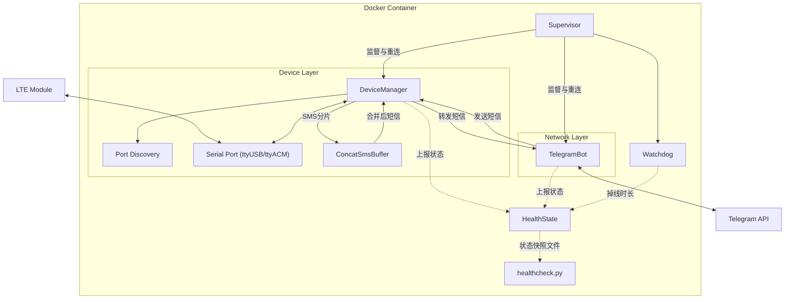

# SMS_forwarder_Telegram (EC200)

该项目将GSM/LTE通信模块接收到的短信转发至Telegram机器人，同时支持通过Telegram发送短信。

## 说明文档
[English](README.md) | [日本語](README_JP.md) | [简体中文](README_CN.md) | [فارسی](README_FA.md)

## 功能特点

- 自动转发接收到的短信到Telegram
- 通过Telegram回复短信
- **长短信自动合并**：自动识别并合并分片短信，确保完整接收长文本
- 支持主流LTE模块（如EC200T/EC200S/EC200A等系列）
- Docker部署，易于安装和管理
- **串口自动发现**：自行探测模块的AT端口，无需配置设备路径
- **等待硬件就绪**：可在模块尚未枚举完成时启动，设备出现后立即接管
- **服务健康检查**：监督、健康上报与看门狗共同保证服务无人值守运行

## 系统架构



`Supervisor` 驱动两个相互独立的组件。每个组件各自连接、运行，失败后按指数退避重连，
彼此不互相等待。只有当一次会话持续超过 `SERVICE_STABLE_SECONDS` 后，组件才算真正恢复，
因此「连上就立刻断开」的组件仍会被判定为故障。`HealthState` 记录这一状态，
若任一组件掉线时间超过 `WATCHDOG_DOWN_SECONDS`，看门狗会退出进程；
`healthcheck.py` 则把同一状态报告给容器运行时。

## 硬件要求

- 可能支持的LTE模块（尚未全部实际验证）：
  - EC200T系列
  - EC200S系列
  - EC200A系列
  - EC200N-CN
  - EC600S系列
  - EC600N系列
  - EC800N系列
  - EG912Y-EU
  - EG915N-EU
  - 其他支持AT命令的GSM/LTE模块
- 用于连接模块的USB数据线
- 运行Linux的服务器/计算机

## 安装步骤

### 1. 准备硬件

1. 将SIM卡插入LTE模块
2. 通过USB数据线将模块连接到Linux主机

### 2. 确认设备识别

连接模块后，Linux会创建多个串口设备：

```bash
ls -l /dev/ttyUSB*
```

通常会看到多个设备（例如ttyUSB0、ttyUSB1、ttyUSB2等），其中只有一个接受AT命令。
**一般无需自行判断是哪一个**：服务启动时会逐个探测，并保留能够应答的那个端口，
详见「串口选择」一节。

不过这条列表仍有一处值得留意：日期前的两个数字是设备的主设备号与次设备号。
主设备号决定容器需要哪一条 `device_cgroup_rules` 规则，
而两种常见取值（`ttyUSB*` 为 188，`ttyACM*` 为 166）已经写在示例编排文件中。

### 3. 避免设备冲突

某些系统服务可能会占用模块串口，需确保端口可用：

```bash
# 检查是否有服务占用串口
lsof /dev/ttyUSB*

# 禁用可能干扰的服务（如ModemManager）
sudo systemctl stop ModemManager
sudo systemctl disable ModemManager
```

这一步比看上去更重要：端口探测以独占方式打开候选设备，并跳过已被其他进程占用的端口，
因此一个占着AT端口的调制解调器管理服务会让模块对本服务完全不可见。

### 4. 创建私有Telegram机器人

1. 在Telegram中，与[@BotFather](https://t.me/botfather)对话创建新机器人
2. 按照指引完成创建流程，获取机器人TOKEN
3. 获取您的Telegram用户ID (CHAT_ID)：
   - 与[@userinfobot](https://t.me/userinfobot)对话获取
   - 或通过其他CHAT_ID获取机器人发送消息

详细教程可参考[Telegram Bot API文档](https://core.telegram.org/bots/api)

### 5. 配置项目

1. 拉取Docker镜像。`latest` 镜像已支持 `linux/amd64` 和 `linux/arm64`：

```bash
docker pull vxhorse/sms-forwarder
```

2. 从脱敏模板创建本地配置文件：

```bash
cp .env.example .env
cp docker-compose.example.yml docker-compose.yml
```

3. 根据实际环境编辑 `.env`。

必须修改的只有两项：
- `BOT_TOKEN`: 替换为您的Telegram机器人Token
- `CHAT_ID`: 替换为您的Telegram用户ID

其余各项都有可用的默认值：
- `SMS_PORT`: 保持为空即可，只有当自动发现选错设备时才需要设置，详见「串口选择」一节
- `PROXY_URL`: 留空表示直连Telegram API；如需代理再填写（例如 `http://127.0.0.1:7890`）
- 编排文件中完全不需要写设备路径，详见「为什么不使用 `devices:`」一节

### 6. 启动服务

```bash
docker compose up -d
```

确认启动情况：

```bash
docker compose ps          # 健康状态由 starting 变为 healthy
docker compose logs -f     # 跟踪启动过程
```

容器最多会显示三分钟的 `starting`，这是正常现象：组件必须在连接持续
`SERVICE_STABLE_SECONDS` 之后才会被标记为就绪，因此第一次健康上报不可能更早，
而此时模块也可能仍在枚举。

## 配置说明

### 环境变量

全部配置均从环境变量读取，且都有默认值。可用的 `.env` 只需填写
`BOT_TOKEN` 与 `CHAT_ID`。时间单位均为秒。

| 变量 | 默认值 | 用途 |
| --- | --- | --- |
| `LOG_LEVEL` | `INFO` | 日志级别 |
| `SMS_PORT` | *(空)* | 模块AT端口，留空表示自动发现 |
| `SMS_BAUDRATE` | `115200` | 串口波特率 |
| `SMS_DEV_ROOT` | `/dev` | 扫描设备的根目录，编排文件中设为 `/hostdev` |
| `PORT_PROBE_TIMEOUT` | `3.0` | 候选端口应答 `AT` 的时限 |
| `BOT_TOKEN` | *(占位符)* | Telegram机器人Token |
| `CHAT_ID` | *(占位符)* | 接收转发短信的Telegram会话 |
| `PROXY_URL` | *(空)* | 访问Telegram API的出站代理，留空表示直连 |
| `NOTIFY_TIMEOUT` | `5.0` | 单次状态通知的时限，取值被限制在 1–10 |
| `RECONNECT_BACKOFF_MIN` | `1.0` | 重连退避的最小间隔 |
| `RECONNECT_BACKOFF_MAX` | `30.0` | 重连退避的最大间隔 |
| `SERVICE_STABLE_SECONDS` | `60.0` | 会话持续多久才算恢复，下限为 5 |
| `MODEM_PROBE_INTERVAL` | `30.0` | 心跳探测间隔，上限为 `HEALTH_STALE_SECONDS` 的一半 |
| `MODEM_PROBE_TIMEOUT` | `5.0` | 模块应答一次探测的时限 |
| `MODEM_PROBE_FAILURES` | `3` | 连续丢失多少次探测后触发重连 |
| `AT_COMMAND_TIMEOUT` | `3.0` | 单条AT命令的时限 |
| `AT_SLOW_COMMAND_TIMEOUT` | `10.0` | 慢速命令（`AT&F`、`AT+CFUN`、`AT&W`）的时限 |
| `HEALTH_FILE` | `/tmp/healthy` | 健康检查读取的状态快照文件 |
| `HEALTH_STALE_SECONDS` | `120` | 该快照的最大允许陈旧时间，下限为 2 |
| `WATCHDOG_DOWN_SECONDS` | `3600` | 组件掉线超过该时长后退出进程 |
| `WATCHDOG_CHECK_INTERVAL` | `30.0` | 看门狗检查间隔，下限为 1 |

### 串口选择

`SMS_PORT` 可以留空。服务启动时会扫描候选串口，
并保留第一个用 `OK` 应答 `AT` 的端口：

1. `$SMS_DEV_ROOT/serial/by-id/*` —— 标识稳定，优先尝试
2. `$SMS_DEV_ROOT/ttyUSB*`
3. `$SMS_DEV_ROOT/ttyACM*`

板载串口（`ttyS*`）永远不会被探测，因为在许多板子上 `ttyS0` 是内核控制台。

这一点很重要：这类模块会暴露多个串口，其中只有一个接受AT命令。
只有当您接入了多个模块，或设备位于不寻常的位置时，才需要显式设置 `SMS_PORT`。

如果确实要设置，请按服务自身看到的路径填写。使用本仓库的编排文件时，
主机的 `/dev` 被挂载到 `/hostdev`，因此端口是 `/hostdev/ttyUSB2`，而不是 `/dev/ttyUSB2`。

### 为什么不使用 `devices:`

编排文件采用绑定挂载 `/dev` 并通过 `device_cgroup_rules` 授权的方式，
而不是使用 `devices:` 映射。

`devices:` 条目是在容器**创建**时解析的。如果那一刻设备尚不存在，创建就会失败，
容器根本不会进入运行状态，重启策略也就永远不会生效
—— 重启策略只覆盖那些已经运行过、随后退出的容器。
在启动较快的机器上，容器运行时很容易早于USB模块完成枚举，
此时容器会一直处于停止状态，直到有人手动启动它。

改用绑定挂载后，容器创建不再依赖设备是否存在。之后才出现的设备会自动出现在容器内，
服务则以指数退避的方式等待它。

如果您的模块不是USB串口设备（主设备号 188）而是CDC-ACM设备（主设备号 166），
两者都已在允许之列。可用 `ls -l /dev/ttyUSB*` 或 `ls -l /dev/ttyACM*` 确认。

## 使用说明

服务启动后，将自动监听接收短信并转发至配置的Telegram会话。

### 通过Telegram发送短信

在Telegram机器人对话中：

1. 使用`/sendsms`命令开始发送流程
2. 按提示输入目标手机号码
3. 按提示输入短信内容
4. 短信发送后会收到确认

### 查看帮助

在Telegram机器人对话中发送`/help`查看所有可用命令。

## 注意事项

- **长短信支持**：本服务已支持长短信自动合并，分片短信会在60秒内等待所有分片到达后合并转发
- **兼容性**：不同型号的模块兼容性不同，某些模块可能不支持长文本短信的收发
- **稳定性**：各组件独立按指数退避重连；若某组件掉线超过 `WATCHDOG_DOWN_SECONDS`，看门狗会重启进程
- **串口选择**：优先让 `SMS_PORT` 保持为空，由自动发现决定；只有当发现选错设备时才设置，并填写 `SMS_DEV_ROOT` 之下的路径
- **没有硬件不算错误**：未接入模块时，服务会无限期等待并重试，其间容器报告为不健康
- **SIM卡检测**：确保SIM卡正确插入并有足够余额
- **网络依赖**：Telegram通信需要稳定的网络连接
- **防火墙设置**：确保服务器允许Telegram API的网络连接

## 故障排除

1. **短信无法收发**：
   - 在日志中确认实际发现的端口：`docker compose logs | grep -i port`
   - 确认SIM卡状态（是否有信号、余额）
   - 查看日志：`docker logs sms-forwarder`

2. **Telegram通信问题**：
   - 验证TOKEN和CHAT_ID配置
   - 检查网络连接和代理设置
   - 确认机器人权限设置正确

3. **模块无法识别**：
   - 确认主机能看到设备：`ls -l /dev/ttyUSB*` 与 `dmesg | grep tty`
   - 若主机能看到而容器看不到，检查列表中的主设备号是否已被 `device_cgroup_rules` 覆盖
   - 插入模块后无需重启任何东西：服务本就在等待，会自行接管
