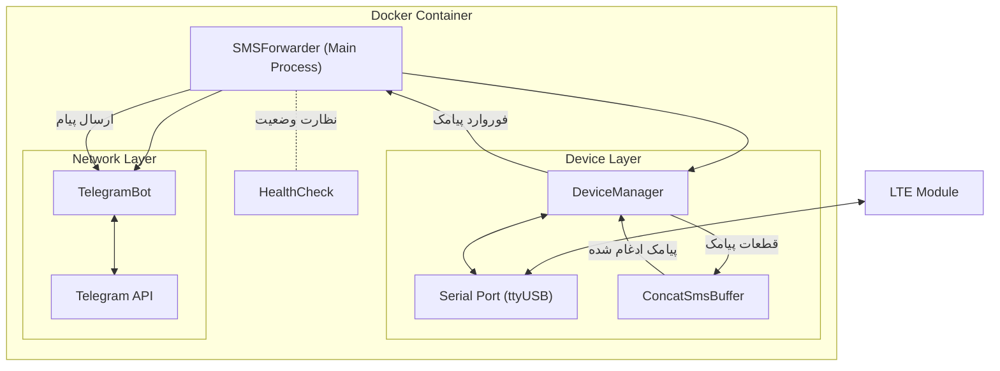

# SMS_forwarder_Telegram (EC200)

این پروژه پیامک‌های دریافتی توسط ماژول‌های ارتباطی GSM/LTE را به یک ربات تلگرام فوروارد می‌کند و همچنین از ارسال پیامک از طریق تلگرام پشتیبانی می‌کند.

## مستندات
[English](README.md) | [日本語](README_JP.md) | [简体中文](README_CN.md) | [فارسی](README_FA.md)

## ویژگی‌ها

- فوروارد خودکار پیامک‌های دریافتی به تلگرام
- پاسخ به پیامک از طریق تلگرام
- **ادغام خودکار پیامک‌های طولانی**: شناسایی و ادغام خودکار پیامک‌های چند بخشی برای اطمینان از دریافت متن کامل
- پشتیبانی از ماژول‌های رایج LTE (مانند سری EC200T/EC200S/EC200A)
- استقرار با Docker برای نصب و مدیریت آسان
- پشتیبانی از Hot-plug برای ماژول‌ها
- **بررسی سلامت سرویس**: مکانیزم داخلی بررسی سلامت برای اطمینان از عملکرد پایدار سرویس

## معماری سیستم



## سخت‌افزار مورد نیاز

- ماژول‌های LTE پشتیبانی شده (همه موارد تایید نشده‌اند):
  - سری EC200T
  - سری EC200S
  - سری EC200A
  - EC200N-CN
  - سری EC600S
  - سری EC600N
  - سری EC800N
  - EG912Y-EU
  - EG915N-EU
  - سایر ماژول‌های GSM/LTE که از دستورات AT پشتیبانی می‌کنند
- کابل دیتای USB برای اتصال ماژول
- سرور/کامپیوتر لینوکس

## مراحل نصب

### 1. آماده‌سازی سخت‌افزار

1. سیم‌کارت را در ماژول LTE قرار دهید
2. ماژول را با کابل USB به میزبان لینوکس متصل کنید

### 2. تایید شناسایی دستگاه

پس از اتصال ماژول، لینوکس چندین دستگاه پورت سریال ایجاد می‌کند. باید پورت صحیح ارتباط پیامک را تایید کنید:

```bash
ls -l /dev/ttyUSB*
```

معمولاً چندین دستگاه (مثلاً ttyUSB0، ttyUSB1، ttyUSB2 و غیره) خواهید دید. در ماژول‌های مختلف، عملکرد پیامک ممکن است روی دستگاه‌های متفاوتی باشد:
- در اکثر موارد، ttyUSB2 برای عملیات پیامک استفاده می‌شود
- تعیین پورت صحیح ممکن است نیاز به امتحان دستگاه‌های مختلف داشته باشد

### 3. جلوگیری از تداخل دستگاه

برخی از سرویس‌های سیستم ممکن است پورت سریال ماژول را اشغال کنند. اطمینان حاصل کنید که پورت در دسترس است:

```bash
# بررسی کنید که آیا سرویسی از پورت سریال استفاده می‌کند
lsof /dev/ttyUSB*

# غیرفعال کردن سرویس‌هایی که ممکن است تداخل ایجاد کنند (مانند ModemManager)
sudo systemctl stop ModemManager
sudo systemctl disable ModemManager
```

### 4. ساخت ربات تلگرام خصوصی

1. در تلگرام، با [@BotFather](https://t.me/botfather) چت کنید تا یک ربات جدید بسازید
2. دستورالعمل‌ها را دنبال کنید تا فرآیند ساخت تکمیل شود و TOKEN ربات را دریافت کنید
3. شناسه کاربری تلگرام (CHAT_ID) خود را دریافت کنید:
   - برای دریافت آن با [@userinfobot](https://t.me/userinfobot) چت کنید
   - یا از طریق روش‌های دیگر برای ارسال پیام توسط ربات آن را دریافت کنید

برای آموزش دقیق، به [مستندات API ربات تلگرام](https://core.telegram.org/bots/api) مراجعه کنید

### 5. پیکربندی پروژه

1. دریافت ایمیج Docker:

```bash
docker pull vxhorse/sms-forwarder
```

2. یک فایل `docker-compose.yml` ایجاد کنید و متغیرهای محیطی و نگاشت دستگاه را پیکربندی کنید:

```yaml
services:
  sms-forwarder:
    image: vxhorse/sms-forwarder:latest
    container_name: sms-forwarder
    restart: unless-stopped
    network_mode: "host"
    stop_grace_period: 30s
    devices:
      - /dev/ttyUSB2:/dev/ttyUSB2
    volumes:
      - /etc/localtime:/etc/localtime:ro
    environment:
      - LOG_LEVEL=INFO
      - SMS_PORT=/dev/ttyUSB2
      - SMS_BAUDRATE=115200
      - BOT_TOKEN=your_telegram_bot_token
      - CHAT_ID=your_telegram_chat_id
      - PROXY_URL=http://127.0.0.1:7890
    healthcheck:
      test: ["CMD", "python", "-c", "import os; exit(0 if os.path.exists('/tmp/healthy') else 1)"]
      interval: 30s
      timeout: 10s
      retries: 3
      start_period: 60s
```

لطفاً موارد زیر را تغییر دهید:
- `SMS_PORT`: بسته به شرایط واقعی به پورت صحیح ارتباط پیامک تغییر دهید
- `BOT_TOKEN`: با Token ربات تلگرام خود جایگزین کنید
- `CHAT_ID`: با شناسه کاربری تلگرام خود جایگزین کنید
- نگاشت دستگاه `/dev/ttyUSB2:/dev/ttyUSB2`: به پورت صحیح پیامک تغییر دهید

### 6. راه‌اندازی سرویس

```bash
docker compose up -d
```

## راهنمای استفاده

پس از راه‌اندازی سرویس، به طور خودکار پیامک‌های دریافتی را نظارت کرده و به مکالمه تلگرام پیکربندی شده فوروارد می‌کند.

### ارسال پیامک از طریق تلگرام

در چت ربات تلگرام:

1. از دستور `/sendsms` برای شروع فرآیند ارسال استفاده کنید
2. طبق دستور شماره تلفن مقصد را وارد کنید
3. طبق دستور متن پیامک را وارد کنید
4. پس از ارسال پیامک تاییدیه دریافت خواهید کرد

### مشاهده راهنما

در چت ربات تلگرام `/help` را ارسال کنید تا تمام دستورات موجود را مشاهده کنید.

## نکات

- **پشتیبانی از پیامک طولانی**: این سرویس از ادغام خودکار پیامک‌های طولانی پشتیبانی می‌کند. پیام‌های چند بخشی تا 60 ثانیه منتظر دریافت تمام بخش‌ها می‌مانند تا ادغام و فوروارد شوند.
- **سازگاری**: مدل‌های مختلف ماژول سازگاری متفاوتی دارند؛ برخی ماژول‌ها ممکن است از ارسال و دریافت پیامک‌های متنی طولانی پشتیبانی نکنند
- **پایداری**: سرویس دارای بررسی سلامت داخلی و مکانیزم راه‌اندازی مجدد خودکار است؛ قطع ارتباط شبکه به طور خودکار بازیابی می‌شود
- **انتخاب پورت سریال**: در صورت بروز مشکل ارتباطی، سعی کنید متغیر محیطی `SMS_PORT` را به سایر دستگاه‌های ttyUSB تغییر دهید
- **تشخیص سیم‌کارت**: اطمینان حاصل کنید که سیم‌کارت به درستی وارد شده و شارژ کافی دارد
- **وابستگی به شبکه**: ارتباط تلگرام نیاز به اتصال شبکه پایدار دارد
- **تنظیمات فایروال**: اطمینان حاصل کنید که سرور اجازه اتصال شبکه به API تلگرام را می‌دهد

## عیب‌یابی

1. **عدم امکان ارسال/دریافت پیامک**:
   - بررسی کنید که پورت سریال ماژول به درستی پیکربندی شده باشد
   - وضعیت سیم‌کارت (سیگنال، شارژ) را تایید کنید
   - بررسی لاگ‌ها: `docker logs sms-forwarder`

2. **مشکلات ارتباطی تلگرام**:
   - پیکربندی TOKEN و CHAT_ID را تایید کنید
   - اتصال شبکه و تنظیمات پروکسی را بررسی کنید
   - تایید کنید تنظیمات دسترسی ربات صحیح است

3. **عدم شناسایی ماژول**:
   - ماژول را جدا و دوباره وصل کنید
   - اتصال USB را بررسی کنید
   - تایید کنید سیستم دستگاه را شناسایی می‌کند: `dmesg | grep tty`
