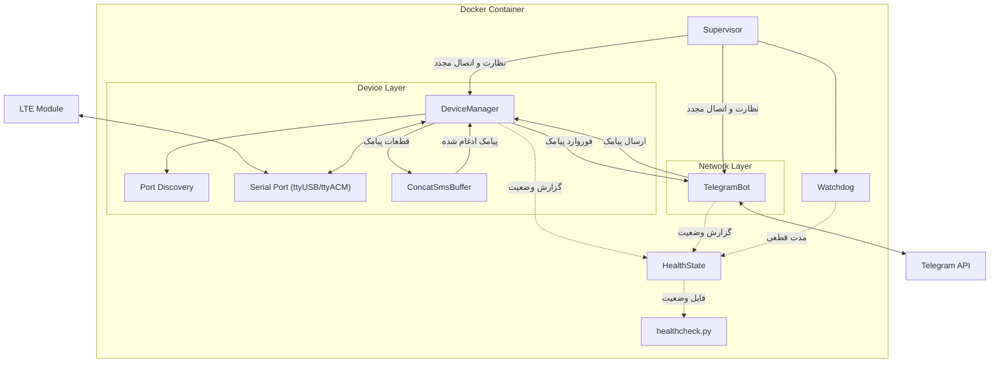

# SMS_forwarder_Telegram (EC200)

این پروژه پیامک‌های دریافتی توسط ماژول‌های ارتباطی GSM/LTE را به یک ربات تلگرام فوروارد می‌کند و همچنین از ارسال پیامک از طریق تلگرام پشتیبانی می‌کند.

## مستندات
[English](README.md) | [日本語](README_JP.md) | [简体中文](README_CN.md) | [فارسی](README_FA.md)

## ویژگی‌ها

- فوروارد خودکار پیامک‌های دریافتی به تلگرام
- پاسخ به پیامک از طریق تلگرام
- **ادغام خودکار پیامک‌های طولانی**: شناسایی و ادغام خودکار پیامک‌های چند بخشی برای اطمینان از دریافت متن کامل
- پشتیبانی از ماژول‌های رایج LTE (مانند سری EC200T/EC200S/EC200A)
- استقرار با Docker برای نصب و مدیریت آسان
- **کشف خودکار پورت**: سرویس خودش پورت AT ماژول را پیدا می‌کند و نیازی به تنظیم مسیر دستگاه نیست
- **انتظار برای سخت‌افزار**: می‌تواند پیش از کامل شدن شناسایی ماژول اجرا شود و به‌محض ظاهر شدن دستگاه متصل شود
- **بررسی سلامت سرویس**: نظارت، گزارش سلامت و واچ‌داگ با هم اجرای بدون سرپرست سرویس را تضمین می‌کنند

## معماری سیستم


```mermaid
graph TD
    subgraph DC [Docker Container]
        Sup[Supervisor]
        WD[Watchdog]
        HS[HealthState]
        HC["healthcheck.py"]

        subgraph DeviceLayer [Device Layer]
            DM[DeviceManager]
            Disc[Port Discovery]
            Serial["Serial Port (ttyUSB/ttyACM)"]
            Buffer[ConcatSmsBuffer]
        end

        subgraph NetworkLayer [Network Layer]
            Bot[TelegramBot]
        end
    end

    Hardware[LTE Module] <--> Serial
    Sup -- "نظارت و اتصال مجدد" --> DM
    Sup -- "نظارت و اتصال مجدد" --> Bot
    Sup --> WD
    DM --> Disc
    DM <--> Serial
    DM -- "قطعات پیامک" --> Buffer
    Buffer -- "پیامک ادغام شده" --> DM
    DM -- "فوروارد پیامک" --> Bot
    Bot -- "ارسال پیامک" --> DM
    Bot <--> API[Telegram API]

    DM -. "گزارش وضعیت" .-> HS
    Bot -. "گزارش وضعیت" .-> HS
    WD -. "مدت قطعی" .-> HS
    HS -. "فایل وضعیت" .-> HC
```

`Supervisor` دو مؤلفه مستقل را اداره می‌کند. هر مؤلفه جداگانه متصل و اجرا می‌شود و در صورت
خطا با تأخیر نمایی دوباره وصل می‌شود؛ هیچ‌کدام منتظر دیگری نمی‌ماند. یک مؤلفه تنها زمانی
بازیابی‌شده به حساب می‌آید که نشست آن به اندازه `SERVICE_STABLE_SECONDS` دوام آورده باشد،
بنابراین مؤلفه‌ای که وصل می‌شود و بی‌درنگ می‌افتد همچنان خراب دیده می‌شود. `HealthState`
این وضعیت را ثبت می‌کند، واچ‌داگ در هر یک از دو حالتی که یک مؤلفه از دست می‌رود فرایند را
خاتمه می‌دهد — قطع‌ماندن بیش از `WATCHDOG_DOWN_SECONDS`، یا گزارش‌دادن وضعیت سالم در حالی
که حلقه‌اش به مدت `WATCHDOG_STALL_SECONDS` هیچ پیشرفتی نکرده است — و `healthcheck.py`
همان وضعیت را به محیط اجرای کانتینر گزارش می‌کند.

## سخت‌افزار مورد نیاز

- ماژول‌های LTE پشتیبانی شده (همه موارد تایید نشده‌اند):
  - سری EC200T
  - سری EC200S
  - سری EC200A
  - EC200N-CN
  - سری EC600S
  - سری EC600N
  - سری EC800N
  - EG912Y-EU
  - EG915N-EU
  - سایر ماژول‌های GSM/LTE که از دستورات AT پشتیبانی می‌کنند
- کابل دیتای USB برای اتصال ماژول
- سرور/کامپیوتر لینوکس

## مراحل نصب

### 1. آماده‌سازی سخت‌افزار

1. سیم‌کارت را در ماژول LTE قرار دهید
2. ماژول را با کابل USB به میزبان لینوکس متصل کنید

### 2. تایید شناسایی دستگاه

پس از اتصال ماژول، لینوکس چندین دستگاه پورت سریال ایجاد می‌کند:

```bash
ls -l /dev/ttyUSB*
```

معمولاً چندین دستگاه (مثلاً ttyUSB0، ttyUSB1، ttyUSB2 و غیره) خواهید دید که تنها یکی از
آن‌ها دستورات AT را می‌پذیرد. **معمولاً لازم نیست خودتان تشخیص دهید کدام است**: سرویس هنگام
راه‌اندازی همه را امتحان می‌کند و آن که پاسخ دهد را نگه می‌دارد. به بخش «انتخاب پورت سریال»
مراجعه کنید.

با این حال خواندن این فهرست یک فایده دیگر هم دارد: دو عددی که پیش از تاریخ می‌آیند شماره
major و minor دستگاه هستند. شماره major تعیین می‌کند کانتینر به کدام قاعده
`device_cgroup_rules` نیاز دارد، و هر دو مقدار رایج (۱۸۸ برای `ttyUSB*` و ۱۶۶ برای
`ttyACM*`) از پیش در فایل نمونه استقرار وجود دارند.

### 3. جلوگیری از تداخل دستگاه

برخی از سرویس‌های سیستم ممکن است پورت سریال ماژول را اشغال کنند. اطمینان حاصل کنید که پورت در دسترس است:

```bash
# بررسی کنید که آیا سرویسی از پورت سریال استفاده می‌کند
lsof /dev/ttyUSB*

# غیرفعال کردن سرویس‌هایی که ممکن است تداخل ایجاد کنند (مانند ModemManager)
sudo systemctl stop ModemManager
sudo systemctl disable ModemManager
```

این مرحله از آنچه به نظر می‌رسد مهم‌تر است: کشف پورت، هر گزینه را به‌صورت انحصاری باز می‌کند
و از پورتی که فرایند دیگری در اختیار دارد عبور می‌کند؛ بنابراین یک مدیر مودم که پورت AT را
گرفته باشد، ماژول را برای این سرویس کاملاً نامرئی می‌کند.

### 4. ساخت ربات تلگرام خصوصی

1. در تلگرام، با [@BotFather](https://t.me/botfather) چت کنید تا یک ربات جدید بسازید
2. دستورالعمل‌ها را دنبال کنید تا فرآیند ساخت تکمیل شود و TOKEN ربات را دریافت کنید
3. شناسه کاربری تلگرام (CHAT_ID) خود را دریافت کنید:
   - برای دریافت آن با [@userinfobot](https://t.me/userinfobot) چت کنید
   - یا از طریق روش‌های دیگر برای ارسال پیام توسط ربات آن را دریافت کنید

برای آموزش دقیق، به [مستندات API ربات تلگرام](https://core.telegram.org/bots/api) مراجعه کنید

### 5. پیکربندی پروژه

1. ایمیج Docker را دریافت کنید. ایمیج `latest` از `linux/amd64` و `linux/arm64` پشتیبانی می‌کند:

```bash
docker pull vxhorse/sms-forwarder
```

یا می‌توانید ایمیج را از همین مخزن بسازید، که معمولاً وقتی تازه آن را کلون کرده‌اید همین کار را می‌کنید:

```bash
docker build -t sms-forwarder .
```

اگر خودتان می‌سازید، در `docker-compose.yml` مقدار `image:` را روی `sms-forwarder` بگذارید.

2. فایل‌های پیکربندی محلی را از قالب‌های بدون اطلاعات حساس ایجاد کنید:

```bash
cp .env.example .env
cp docker-compose.example.yml docker-compose.yml
```

3. فایل `.env` را مطابق محیط واقعی خود ویرایش کنید.

تنها دو مقدار حتماً باید تغییر کنند:
- `BOT_TOKEN`: با Token ربات تلگرام خود جایگزین کنید
- `CHAT_ID`: با شناسه کاربری تلگرام خود جایگزین کنید

بقیه موارد مقدار پیش‌فرض کارآمد دارند:
- `SMS_PORT`: خالی بگذارید، مگر آنکه کشف خودکار دستگاه اشتباهی را انتخاب کند — به بخش «انتخاب پورت سریال» مراجعه کنید
- `PROXY_URL`: خالی یعنی اتصال مستقیم به API تلگرام؛ در صورت نیاز پروکسی خود را وارد کنید (مثلاً `http://127.0.0.1:7890`)
- در فایل استقرار هیچ مسیر دستگاهی لازم نیست — به بخش «چرا از `devices:` استفاده نمی‌کنیم» مراجعه کنید

### 6. راه‌اندازی سرویس

```bash
docker compose up -d
```

بالا آمدن آن را بررسی کنید:

```bash
docker compose ps          # وضعیت سلامت از starting به healthy می‌رسد
docker compose logs -f     # دنبال کردن روند راه‌اندازی
```

کانتینر تا سه دقیقه وضعیت `starting` را گزارش می‌کند و این طبیعی است.
بخش «خواندن بررسی سلامت» توضیح می‌دهد هر وضعیت سلامت چه معنایی دارد و چطور آن را ببینید.

## پیکربندی

### متغیرهای محیطی

همه تنظیمات از محیط خوانده می‌شوند و همه مقدار پیش‌فرض دارند. یک `.env` کارآمد فقط به
`BOT_TOKEN` و `CHAT_ID` نیاز دارد. واحد زمان‌ها ثانیه است.

| متغیر | پیش‌فرض | کاربرد |
| --- | --- | --- |
| `LOG_LEVEL` | `INFO` | سطح جزئیات لاگ |
| `SMS_PORT` | *(خالی)* | پورت AT ماژول. خالی یعنی کشف خودکار |
| `SMS_BAUDRATE` | `115200` | سرعت سریال |
| `SMS_DEV_ROOT` | `/dev` | مسیر پویش دستگاه‌ها. فایل استقرار آن را `/hostdev` می‌گذارد |
| `PORT_PROBE_TIMEOUT` | `3.0` | مهلت پاسخ `AT` برای هر پورت کاندید |
| `BOT_TOKEN` | *(جایگزین)* | توکن ربات تلگرام |
| `CHAT_ID` | *(جایگزین)* | چت تلگرامی که پیامک‌ها به آن فوروارد می‌شود |
| `PROXY_URL` | *(خالی)* | پروکسی خروجی برای API تلگرام. خالی یعنی اتصال مستقیم |
| `NOTIFY_TIMEOUT` | `5.0` | مهلت یک اعلان وضعیت. محدود به بازه ۱ تا ۱۰ |
| `RECONNECT_BACKOFF_MIN` | `1.0` | کمترین فاصله میان تلاش‌های اتصال مجدد |
| `RECONNECT_BACKOFF_MAX` | `30.0` | بیشترین فاصله میان تلاش‌های اتصال مجدد |
| `SERVICE_STABLE_SECONDS` | `60.0` | مدت دوام نشست تا بازیابی به حساب آید. کف آن ۵ است |
| `MODEM_PROBE_INTERVAL` | `30.0` | فاصله بررسی زنده‌بودن. حداکثر نیمی از `HEALTH_STALE_SECONDS` |
| `MODEM_PROBE_TIMEOUT` | `5.0` | مهلت پاسخ ماژول به هر بررسی |
| `MODEM_PROBE_FAILURES` | `3` | تعداد بررسی‌های پیاپی ناموفق تا اتصال مجدد |
| `MODEM_REGISTRATION_CHECK` | `0` | پرسیدن اینکه ماژول به شبکه متصل است یا نه. پیش‌فرض خاموش — به [بررسی ثبت در شبکه](#بررسی-ثبت-در-شبکه) نگاه کنید |
| `MODEM_REGISTRATION_FAILURES` | `3` | با روشن‌بودن بررسی بالا، تعداد خوانش‌های پیاپی «ثبت‌نشده» تا اتصال مجدد. کف آن ۲ است |
| `AT_COMMAND_TIMEOUT` | `3.0` | مهلت یک دستور AT |
| `AT_SLOW_COMMAND_TIMEOUT` | `10.0` | مهلت دستورات کند (`AT&F`، `AT+CFUN`، `AT&W`) |
| `SERIAL_CLOSE_TIMEOUT` | `5.0` | مهلت تخلیه بافر هنگام رهاکردن پورت سریال؛ پس از آن بستن به‌اجبار انجام می‌شود. کف آن ۱ است |
| `HEALTH_FILE` | `/tmp/healthy` | فایل وضعیتی که بررسی سلامت می‌خواند |
| `HEALTH_STALE_SECONDS` | `120` | حداکثر کهنگی مجاز آن فایل. کف آن ۲ است |
| `WATCHDOG_DOWN_SECONDS` | `3600` | خروج پس از این مدت قطعی یک مؤلفه |
| `WATCHDOG_STALL_SECONDS` | *(مشتق‌شده)* | خروج وقتی هیچ حلقه‌ای به این مدت پیشرفتی نکرده باشد. پیش‌فرض دو برابر `HEALTH_STALE_SECONDS` است، با کفی مشتق‌شده بالا می‌رود (با مقادیر پیش‌فرض حدود ۳۱۰) و سقف آن `WATCHDOG_DOWN_SECONDS` است |
| `WATCHDOG_CHECK_INTERVAL` | `30.0` | فاصله بررسی واچ‌داگ. کف آن ۱ است |

### انتخاب پورت سریال

`SMS_PORT` می‌تواند خالی بماند. سرویس هنگام راه‌اندازی پورت‌های سریال کاندید را پویش می‌کند
و نخستین پورتی را نگه می‌دارد که به `AT` با `OK` پاسخ دهد:

1. `$SMS_DEV_ROOT/serial/by-id/*` — شناسه‌های پایدار، اول امتحان می‌شوند
2. `$SMS_DEV_ROOT/ttyUSB*`
3. `$SMS_DEV_ROOT/ttyACM*`

پورت‌های سریال داخلی (`ttyS*`) هرگز بررسی نمی‌شوند، چون روی بسیاری از بردها `ttyS0`
کنسول کرنل است.

این موضوع اهمیت دارد چون ماژول‌های این دسته چند پورت سریال ارائه می‌کنند و تنها یکی از
آن‌ها دستورات AT را می‌پذیرد. `SMS_PORT` را فقط در صورتی صریح تنظیم کنید که بیش از یک
ماژول دارید یا دستگاه شما در مسیری غیرمعمول است.

اگر آن را تنظیم می‌کنید، مسیر را همان‌طور بنویسید که سرویس می‌بیند. با فایل استقرار این
مخزن، مسیر `/dev` میزبان روی `/hostdev` سوار می‌شود، پس پورت `/hostdev/ttyUSB2` است،
نه `/dev/ttyUSB2`.

### بررسی ثبت در شبکه

ضربان قلب ثابت می‌کند که ماژول پاسخ می‌دهد، اما ثابت نمی‌کند که پیامکی به آن می‌رسد: سیم‌کارتی
که شبکه آن را جدا کرده، دقیقاً مثل قبل به هر دستور پاسخ می‌دهد در حالی که هیچ پیامی نمی‌رسد.
با `MODEM_REGISTRATION_CHECK=1` پرسش دومی هم افزوده می‌شود، `AT+CREG?`، و پس از
`MODEM_REGISTRATION_FAILURES` خوانش پیاپی «ثبت‌نشده» نشست پایان می‌یابد.

این بررسی **خاموش** عرضه می‌شود، چون آن پرسش روی هر شبکه‌ای پاسخ درستی ندارد. `+CREG`
دامنه مدارگردان را توصیف می‌کند، پس شبکه‌ای که ماژول را تنها برای سرویس بسته‌ای ثبت می‌کند —
و پیامک‌ها از مسیری می‌رسند که آن دامنه توصیفش نمی‌کند — در حالی که همه‌چیز کار می‌کند
«ثبت‌نشده» گزارش می‌دهد. عمل‌کردن بر پایه آن، هر چند دقیقه یک نشست سالم را پایان می‌دهد،
هر بار رادیو را از نو راه می‌اندازد (که بازیابی از یک قطعی واقعی را طولانی‌تر می‌کند، نه
کوتاه‌تر) و در هر چرخه پیکربندی ذخیره‌شده ماژول را بازنویسی می‌کند. این حلقه از بیرون هم
به‌سختی دیده می‌شود: خطا دیرتر از زمانی رخ می‌دهد که یک نشست بازیابی‌شده به حساب می‌آید، پس
هر چرخه آنچه را واچ‌داگ می‌سنجد صفر می‌کند، و فایل وضعیت تنها به اندازه یک قطع‌کردن اتصال
کهنه می‌ماند، پس بررسی سلامت کانتینر در تمام این مدت سبز می‌ماند.

خاموش‌گذاشتن آن تا وقتی وضعیت روشن شود، هیچ اطلاعات تشخیصی را از دست نمی‌دهد. راه‌اندازی از
ماژول می‌خواهد تغییرات ثبت را خودش گزارش کند، پس وضعیت در هر دو حالت تجزیه می‌شود، در فایل
وضعیت منتشر می‌شود و در لاگ می‌آید؛ آنچه به تعویق می‌افتد تنها تصمیم به پایان‌دادن نشست بر
پایه آن است. میدان `registration` را در بازه‌ای که پیامک‌های عادی هم در آن رد و بدل می‌شود
بخوانید:

```bash
docker compose exec sms-forwarder cat /tmp/healthy
```

- روی `1`، `5`، `6` یا `7` می‌ایستد (ثبت در شبکه خانگی، در رومینگ، یا همان دو حالت محدود به
  پیامک) — پرسش روی این شبکه پاسخ درستی دارد و `MODEM_REGISTRATION_CHECK=1` همان تشخیصی را
  می‌دهد که برایش ساخته شده است.
- در حالی که پیامک‌ها می‌رسند روی `0` یا `2` می‌ماند — این همان شبکه‌ای است که این بررسی
  نمی‌تواند توصیفش کند؛ خاموش بماند.

[`doc/README.md`](doc/README.md) ثبت کرده که یک پاسخ کامل به چه چیزی نیاز دارد.

### چرا از `devices:` استفاده نمی‌کنیم

فایل استقرار به‌جای نگاشت `devices:`، مسیر `/dev` را bind mount می‌کند و دسترسی را از راه
`device_cgroup_rules` می‌دهد.

یک ورودی `devices:` هنگام **ساخت** کانتینر تفسیر می‌شود. اگر دستگاه در آن لحظه موجود نباشد،
ساخت شکست می‌خورد، کانتینر هرگز وارد حالت اجرا نمی‌شود و سیاست راه‌اندازی مجدد هم اعمال
نمی‌شود — چون این سیاست فقط کانتینرهایی را پوشش می‌دهد که اجرا شده و سپس خارج شده‌اند.
روی ماشینی که سریع بالا می‌آید، به‌راحتی ممکن است محیط اجرای کانتینر پیش از پایان شناسایی
مودم USB شروع شود و کانتینر تا وقتی کسی دستی آن را راه بیندازد خاموش بماند.

با bind mount، ساخت کانتینر دیگر به دستگاه وابسته نیست. دستگاهی که بعداً پیدا شود به‌طور
خودکار داخل کانتینر هم دیده می‌شود و سرویس با تأخیر نمایی منتظر آن می‌ماند.

اگر مودم شما دستگاه سریال USB (major 188) نیست بلکه CDC-ACM (major 166) است، هر دو از پیش
مجاز شده‌اند. با `ls -l /dev/ttyUSB*` یا `ls -l /dev/ttyACM*` بررسی کنید.

### خواندن بررسی سلامت

`healthcheck.py` تنها به یک پرسش پاسخ می‌دهد — آیا این فرایند همین حالا می‌تواند پیامکی را
فوروارد کند — و برای آنکه پاسخ «بله» باشد دو شرط باید هم‌زمان برقرار باشند:

1. فایل وضعیت در مسیر `HEALTH_FILE` کمتر از `HEALTH_STALE_SECONDS` پیش نوشته شده باشد؛
   این نشان می‌دهد فرایند هنوز حلقه‌های خود را اجرا می‌کند.
2. هر مؤلفه‌ای که در آن فایل ثبت شده بالا باشد؛ این نشان می‌دهد فرایند هم به ماژول و هم به
   API تلگرام دسترسی دارد.

این فایل فقط زمانی نوشته می‌شود که همه مؤلفه‌ها بالا باشند، و هر مؤلفه آن را از حلقه خودش
تازه می‌کند. پس فرایندی که از کار افتاده دیگر آن را تازه نمی‌کند و فایلی که جا گذاشته کهنه
می‌شود. تازه بودن به‌تنهایی، و همچنین صرفِ وجود فایل، هرگز سلامت به حساب نمی‌آید.

برای دیدن قضاوت فعلی محیط اجرای کانتینر:

```bash
docker inspect --format '{{.State.Health.Status}}' sms-forwarder
docker inspect --format '{{json .State.Health.Log}}' sms-forwarder
```

یا همان بررسی را دستی اجرا کنید و کد خروج را بخوانید — `0` یعنی سالم و `1` یعنی ناسالم:

```bash
docker compose exec sms-forwarder python /app/healthcheck.py; echo $?
```

سه وضعیت ارزش شناختن دارند:

- **`starting`** — هنوز داخل `start_period` است که فایل استقرار نمونه آن را ۱۸۰ ثانیه
  می‌گذارد. یک مؤلفه تنها پس از آنکه نشستش به اندازه `SERVICE_STABLE_SECONDS` (پیش‌فرض ۶۰
  ثانیه) دوام آورد بالا گزارش می‌شود، و فایل وضعیت تا بالا آمدن همه مؤلفه‌ها نوشته نمی‌شود؛
  پس زودترین نوشتن ممکن یک دقیقه پس از وصل شدن هر دو است. `start_period` باید این مدت به
  علاوه زمان شناسایی ماژول را پوشش دهد؛ اگر ماژول شما کند است آن را بزرگ‌تر کنید.
- **`unhealthy`** — هیچ پیامکی فوروارد نمی‌شود. توجه کنید که این وضعیت به‌خودی‌خود چیزی را
  راه‌اندازی مجدد نمی‌کند و محیط اجرای کانتینر فقط آن را ثبت می‌کند. بازیابی یا از راه اتصال
  مجدد خود سرویس رخ می‌دهد یا از راه واچ‌داگ، که فرایند را خاتمه می‌دهد تا سیاست راه‌اندازی
  مجدد کار را به دست بگیرد. واچ‌داگ دو مسیر خروج دارد و فاصله‌شان یک مرتبه بزرگی است:
  - مؤلفه‌ای که **آشکارا شکست خورده** قطع علامت می‌خورد و پس از `WATCHDOG_DOWN_SECONDS`
    (پیش‌فرض یک ساعت) قطع‌ماندن، فرایند خارج می‌شود. خط لاگ چنین است:
    `Watchdog tripped: a component has been down for ...`.
  - مؤلفه‌ای که **بدون شکست گیر کرده** هنوز بالا علامت خورده است، پس ساعت بالا اصلاً شروع
    نمی‌شود. آنچه آن را می‌گیرد `WATCHDOG_STALL_SECONDS` است: هیچ حلقه‌ای پیشرفتی گزارش
    نکرده و فایل وضعیت هم به این مدت نوشته نشده است. با مقادیر پیش‌فرض این حدود
    **۳۱۰ ثانیه** است، نه یک ساعت؛ پس راه‌اندازی مجددِ بی‌توضیحی که حدود پنج دقیقه پس از
    ساکت‌شدن رخ می‌دهد همین است و نه آن یکی. خط لاگ چنین است:
    `Watchdog tripped: nothing has made progress for ...`، و ننوشتنی‌شدن `HEALTH_FILE` هم
    همین را فعال می‌کند.
- **`healthy`** — فایل وضعیت تازه است و همه مؤلفه‌ها بالا هستند.

## راهنمای استفاده

پس از راه‌اندازی سرویس، به طور خودکار پیامک‌های دریافتی را نظارت کرده و به مکالمه تلگرام پیکربندی شده فوروارد می‌کند.

### ارسال پیامک از طریق تلگرام

در چت ربات تلگرام:

1. از دستور `/sendsms` برای شروع فرآیند ارسال استفاده کنید
2. طبق دستور شماره تلفن مقصد را وارد کنید
3. طبق دستور متن پیامک را وارد کنید
4. پس از ارسال پیامک تاییدیه دریافت خواهید کرد

### مشاهده راهنما

در چت ربات تلگرام `/help` را ارسال کنید تا تمام دستورات موجود را مشاهده کنید.

## نکات

- **پشتیبانی از پیامک طولانی**: این سرویس از ادغام خودکار پیامک‌های طولانی پشتیبانی می‌کند. پیام‌های چند بخشی تا 60 ثانیه منتظر دریافت تمام بخش‌ها می‌مانند تا ادغام و فوروارد شوند.
- **سازگاری**: مدل‌های مختلف ماژول سازگاری متفاوتی دارند؛ برخی ماژول‌ها ممکن است از ارسال و دریافت پیامک‌های متنی طولانی پشتیبانی نکنند
- **پایداری**: هر مؤلفه خودش با تأخیر نمایی دوباره وصل می‌شود و اگر چیزی بیش از `WATCHDOG_DOWN_SECONDS` قطع بماند، یا با وجود گزارش سالم به مدت `WATCHDOG_STALL_SECONDS` پیشرفتی نکند، واچ‌داگ فرایند را از نو راه می‌اندازد
- **انتخاب پورت سریال**: `SMS_PORT` را خالی بگذارید تا کشف خودکار انتخاب کند. فقط وقتی دستگاه اشتباهی انتخاب می‌شود آن را تنظیم کنید و مسیر را زیر `SMS_DEV_ROOT` بدهید
- **نبودن سخت‌افزار خطا نیست**: بدون مودم متصل، سرویس بی‌وقفه منتظر می‌ماند و تلاش را تکرار می‌کند؛ در این مدت کانتینر ناسالم گزارش می‌شود
- **تشخیص سیم‌کارت**: اطمینان حاصل کنید که سیم‌کارت به درستی وارد شده و شارژ کافی دارد
- **وابستگی به شبکه**: ارتباط تلگرام نیاز به اتصال شبکه پایدار دارد
- **تنظیمات فایروال**: اطمینان حاصل کنید که سرور اجازه اتصال شبکه به API تلگرام را می‌دهد

## عیب‌یابی

1. **عدم امکان ارسال/دریافت پیامک**:
   - در لاگ ببینید کدام پورت کشف شده است: `docker compose logs | grep -i port`
   - وضعیت سیم‌کارت (سیگنال، شارژ) را تایید کنید
   - بررسی لاگ‌ها: `docker logs sms-forwarder`

2. **مشکلات ارتباطی تلگرام**:
   - پیکربندی TOKEN و CHAT_ID را تایید کنید
   - اتصال شبکه و تنظیمات پروکسی را بررسی کنید
   - تایید کنید تنظیمات دسترسی ربات صحیح است

3. **عدم شناسایی ماژول**:
   - نخست ببینید کشف خودکار چه گزارش کرده است: `docker compose logs | grep -iE 'candidate|discovered|answered'`.
     پیام `Discovered modem AT port: ...` یعنی موفق شده؛ `No candidate port answered AT`
     یعنی همه گزینه‌ها آزمایش شدند و هیچ‌کدام پاسخ نداد؛ و `No candidate serial ports under ...`
     یعنی اصلاً چیزی برای آزمایش نبود
   - تایید کنید میزبان دستگاه را می‌بیند: `ls -l /dev/ttyUSB*` و `dmesg | grep tty`
   - اگر میزبان آن را می‌بیند ولی کانتینر نه، بررسی کنید شماره major در فهرست، در `device_cgroup_rules` پوشش داده شده باشد
   - اگر گزینه‌ها آزمایش شدند و هیچ‌کدام پاسخ نداد، رایج‌ترین علت این است که فرایند دیگری پورت AT
     را در اختیار دارد؛ به بخش «جلوگیری از تداخل دستگاه» مراجعه کنید
   - اگر پورت AT ماژول شما نه `ttyUSB*` است و نه `ttyACM*`، هرگز آزمایش نمی‌شود؛
     `SMS_PORT` را صریح تنظیم کنید و مسیر را زیر `SMS_DEV_ROOT` بدهید
   - پس از اتصال ماژول لازم نیست چیزی راه‌اندازی مجدد شود: سرویس منتظر آن است و خودش آن را برمی‌دارد

4. **ماژولی که این پروژه با آن آزمایش نشده است**:
   - دو دستور از دنباله راه‌اندازی مخصوص سازنده هستند (`AT+QCFG` و `AT+QURCCFG`). ماژولی که
     آن‌ها را پیاده‌سازی نکرده باشد پیام `... was not acknowledged; continuing setup` را ثبت
     می‌کند و ادامه می‌دهد؛ این بی‌ضرر است
   - تنها چهار دستور الزامی‌اند: `AT+CFUN=1`، `AT+CMGF=0`، `AT+CPMS` و `AT+CNMI`. پیام
     `Modem did not acknowledge <command>` و پس از آن یک اتصال مجدد یعنی یکی از این چهار رد
     شده است و ماژول را با وضعیت فعلی نمی‌توان راه‌اندازی کرد
   - فایل [`doc/README.md`](doc/README.md) هر دستوری را که سرویس می‌فرستد به کارکردش نگاشت
     می‌کند تا بتوانید تک‌تک آن‌ها را در دفترچه دستورات AT ماژول خودتان پیدا کنید

5. **کانتینر هرگز سالم نمی‌شود**:
   - تا سه دقیقه `starting` طبیعی است — به بخش «خواندن بررسی سلامت» مراجعه کنید
   - ماندن روی `unhealthy` یعنی یکی از مؤلفه‌ها قطع است، و لاگ می‌گوید کدام:
     `Component <name> failed ...`
   - محیط اجرای کانتینر به‌خاطر ناسالم بودن چیزی را از نو راه نمی‌اندازد. واچ‌داگ فرایند را
     خاتمه می‌دهد — برای مؤلفه‌ای که شکست خورده پس از `WATCHDOG_DOWN_SECONDS`، و برای
     مؤلفه‌ای که بدون شکست از پیشرفت بازمانده پس از `WATCHDOG_STALL_SECONDS` که خیلی
     کوتاه‌تر است — و سیاست راه‌اندازی مجدد کار را ادامه می‌دهد.
     `docker compose logs | grep 'Watchdog tripped'` می‌گوید کدام یک بوده است
