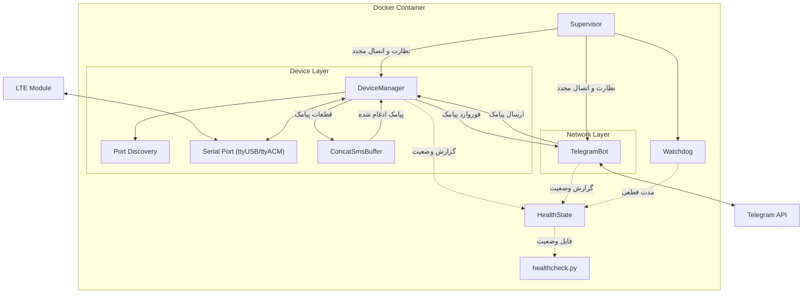

# SMS_forwarder_Telegram (EC200)

این پروژه پیامک‌های دریافتی توسط ماژول‌های ارتباطی GSM/LTE را به یک ربات تلگرام فوروارد می‌کند و همچنین از ارسال پیامک از طریق تلگرام پشتیبانی می‌کند.

## مستندات
[English](README.md) | [日本語](README_JP.md) | [简体中文](README_CN.md) | [فارسی](README_FA.md)

## ویژگی‌ها

- فوروارد خودکار پیامک‌های دریافتی به تلگرام
- پاسخ به پیامک از طریق تلگرام
- **ادغام خودکار پیامک‌های طولانی**: شناسایی و ادغام خودکار پیامک‌های چند بخشی برای اطمینان از دریافت متن کامل
- پشتیبانی از ماژول‌های رایج LTE (مانند سری EC200T/EC200S/EC200A)
- استقرار با Docker برای نصب و مدیریت آسان
- **کشف خودکار پورت**: سرویس خودش پورت AT ماژول را پیدا می‌کند و نیازی به تنظیم مسیر دستگاه نیست
- **انتظار برای سخت‌افزار**: می‌تواند پیش از کامل شدن شناسایی ماژول اجرا شود و به‌محض ظاهر شدن دستگاه متصل شود
- **بررسی سلامت سرویس**: نظارت، گزارش سلامت و واچ‌داگ با هم اجرای بدون سرپرست سرویس را تضمین می‌کنند

## معماری سیستم


```mermaid
graph TD
    subgraph DC [Docker Container]
        Sup[Supervisor]
        WD[Watchdog]
        HS[HealthState]
        HC["healthcheck.py"]

        subgraph DeviceLayer [Device Layer]
            DM[DeviceManager]
            Disc[Port Discovery]
            Serial["Serial Port (ttyUSB/ttyACM)"]
            Buffer[ConcatSmsBuffer]
        end

        subgraph NetworkLayer [Network Layer]
            Bot[TelegramBot]
        end
    end

    Hardware[LTE Module] <--> Serial
    Sup -- "نظارت و اتصال مجدد" --> DM
    Sup -- "نظارت و اتصال مجدد" --> Bot
    Sup --> WD
    DM --> Disc
    DM <--> Serial
    DM -- "قطعات پیامک" --> Buffer
    Buffer -- "پیامک ادغام شده" --> DM
    DM -- "فوروارد پیامک" --> Bot
    Bot -- "ارسال پیامک" --> DM
    Bot <--> API[Telegram API]

    DM -. "گزارش وضعیت" .-> HS
    Bot -. "گزارش وضعیت" .-> HS
    WD -. "مدت قطعی" .-> HS
    HS -. "فایل وضعیت" .-> HC
```

`Supervisor` دو مؤلفه مستقل را اداره می‌کند. هر مؤلفه جداگانه متصل و اجرا می‌شود و در صورت
خطا با تأخیر نمایی دوباره وصل می‌شود؛ هیچ‌کدام منتظر دیگری نمی‌ماند. یک مؤلفه تنها زمانی
بازیابی‌شده به حساب می‌آید که نشست آن به اندازه `SERVICE_STABLE_SECONDS` دوام آورده باشد،
بنابراین مؤلفه‌ای که وصل می‌شود و بی‌درنگ می‌افتد همچنان خراب دیده می‌شود. `HealthState`
این وضعیت را ثبت می‌کند، واچ‌داگ در هر یک از سه حالتی که یک مؤلفه از دست می‌رود فرایند را
خاتمه می‌دهد — قطع‌ماندن بیش از `WATCHDOG_DOWN_SECONDS`؛ گزارش‌دادن وضعیت سالم در حالی
که حلقه‌اش به مدت `WATCHDOG_STALL_SECONDS` هیچ پیشرفتی نکرده است؛ یا پایان‌دادن
`WATCHDOG_CHURN_SESSIONS` نشستِ برقرارشده در بازه `WATCHDOG_CHURN_WINDOW` — و
`healthcheck.py` همان وضعیت را به محیط اجرای کانتینر گزارش می‌کند.

## سخت‌افزار مورد نیاز

- ماژول‌های LTE پشتیبانی شده (همه موارد تایید نشده‌اند):
  - سری EC200T
  - سری EC200S
  - سری EC200A
  - EC200N-CN
  - سری EC600S
  - سری EC600N
  - سری EC800N
  - EG912Y-EU
  - EG915N-EU
  - سایر ماژول‌های GSM/LTE که از دستورات AT پشتیبانی می‌کنند
- کابل دیتای USB برای اتصال ماژول
- سرور/کامپیوتر لینوکس

## مراحل نصب

### 1. آماده‌سازی سخت‌افزار

1. سیم‌کارت را در ماژول LTE قرار دهید
2. ماژول را با کابل USB به میزبان لینوکس متصل کنید

### 2. تایید شناسایی دستگاه

پس از اتصال ماژول، لینوکس چندین دستگاه پورت سریال ایجاد می‌کند:

```bash
ls -l /dev/ttyUSB*
```

معمولاً چندین دستگاه (مثلاً ttyUSB0، ttyUSB1، ttyUSB2 و غیره) خواهید دید که تنها یکی از
آن‌ها دستورات AT را می‌پذیرد. **معمولاً لازم نیست خودتان تشخیص دهید کدام است**: سرویس هنگام
راه‌اندازی همه را امتحان می‌کند و آن که پاسخ دهد را نگه می‌دارد. به بخش «انتخاب پورت سریال»
مراجعه کنید.

با این حال خواندن این فهرست یک فایده دیگر هم دارد: دو عددی که پیش از تاریخ می‌آیند شماره
major و minor دستگاه هستند. شماره major تعیین می‌کند کانتینر به کدام قاعده
`device_cgroup_rules` نیاز دارد، و هر دو مقدار رایج (۱۸۸ برای `ttyUSB*` و ۱۶۶ برای
`ttyACM*`) از پیش در فایل نمونه استقرار وجود دارند.

### 3. جلوگیری از تداخل دستگاه

برخی از سرویس‌های سیستم ممکن است پورت سریال ماژول را اشغال کنند. اطمینان حاصل کنید که پورت در دسترس است:

```bash
# بررسی کنید که آیا سرویسی از پورت سریال استفاده می‌کند
lsof /dev/ttyUSB*

# غیرفعال کردن سرویس‌هایی که ممکن است تداخل ایجاد کنند (مانند ModemManager)
sudo systemctl stop ModemManager
sudo systemctl disable ModemManager
```

این مرحله از آنچه به نظر می‌رسد مهم‌تر است: کشف پورت، هر گزینه را به‌صورت انحصاری باز می‌کند
و از پورتی که فرایند دیگری در اختیار دارد عبور می‌کند؛ بنابراین یک مدیر مودم که پورت AT را
گرفته باشد، ماژول را برای این سرویس کاملاً نامرئی می‌کند.

### 4. ساخت ربات تلگرام خصوصی

1. در تلگرام، با [@BotFather](https://t.me/botfather) چت کنید تا یک ربات جدید بسازید
2. دستورالعمل‌ها را دنبال کنید تا فرآیند ساخت تکمیل شود و TOKEN ربات را دریافت کنید
3. شناسه کاربری تلگرام (CHAT_ID) خود را دریافت کنید:
   - برای دریافت آن با [@userinfobot](https://t.me/userinfobot) چت کنید
   - یا از طریق روش‌های دیگر برای ارسال پیام توسط ربات آن را دریافت کنید

برای آموزش دقیق، به [مستندات API ربات تلگرام](https://core.telegram.org/bots/api) مراجعه کنید

### 5. پیکربندی پروژه

1. ایمیج Docker را دریافت کنید. ایمیج `latest` از `linux/amd64` و `linux/arm64` پشتیبانی می‌کند:

```bash
docker pull vxhorse/sms-forwarder
```

یا می‌توانید ایمیج را از همین مخزن بسازید، که معمولاً وقتی تازه آن را کلون کرده‌اید همین کار را می‌کنید:

```bash
docker build -t sms-forwarder .
```

اگر خودتان می‌سازید، در `docker-compose.yml` مقدار `image:` را روی `sms-forwarder` بگذارید.

2. فایل‌های پیکربندی محلی را از قالب‌های بدون اطلاعات حساس ایجاد کنید:

```bash
cp .env.example .env
cp docker-compose.example.yml docker-compose.yml
```

3. فایل `.env` را مطابق محیط واقعی خود ویرایش کنید.

تنها دو مقدار حتماً باید تغییر کنند:
- `BOT_TOKEN`: با Token ربات تلگرام خود جایگزین کنید
- `CHAT_ID`: با شناسه کاربری تلگرام خود جایگزین کنید

بقیه موارد مقدار پیش‌فرض کارآمد دارند:
- `SMS_PORT`: خالی بگذارید، مگر آنکه کشف خودکار دستگاه اشتباهی را انتخاب کند — به بخش «انتخاب پورت سریال» مراجعه کنید
- `PROXY_URL`: خالی یعنی اتصال مستقیم به API تلگرام؛ در صورت نیاز پروکسی خود را وارد کنید (مثلاً `http://127.0.0.1:7890`)
- در فایل استقرار هیچ مسیر دستگاهی لازم نیست — به بخش «چرا از `devices:` استفاده نمی‌کنیم» مراجعه کنید

### 6. راه‌اندازی سرویس

```bash
docker compose up -d
```

بالا آمدن آن را بررسی کنید:

```bash
docker compose ps          # وضعیت سلامت از starting به healthy می‌رسد
docker compose logs -f     # دنبال کردن روند راه‌اندازی
```

کانتینر تا سه دقیقه وضعیت `starting` را گزارش می‌کند و این طبیعی است.
بخش «خواندن بررسی سلامت» توضیح می‌دهد هر وضعیت سلامت چه معنایی دارد و چطور آن را ببینید.

## پیکربندی

### متغیرهای محیطی

همه تنظیمات از محیط خوانده می‌شوند و همه مقدار پیش‌فرض دارند. یک `.env` کارآمد فقط به
`BOT_TOKEN` و `CHAT_ID` نیاز دارد. واحد زمان‌ها ثانیه است.

ستون **کران‌ها** بخشی از قرارداد است، نه یک پانویس. هر تنظیمی که مقدارش بتواند نگهبانی را
که به‌خاطرش وجود دارد از کار بیندازد، یا خرابی‌ای را که آن نگهبان جلویش را می‌گیرد برگرداند،
کلمپ می‌شود، و لاگ راه‌اندازی نام هر تنظیمی را می‌آورد که یک کران آن را از **مقداری که
خودتان گذاشته‌اید** جابه‌جا کرده باشد. اگر آنچه کران جابه‌جا می‌کند یک پیش‌فرض مشتق‌شده باشد
اعلامی در کار نیست — این می‌شد خواندن حسابی که کسی نپرسیده، در هر بار راه‌اندازی — پس سکوت
هنگام راه‌اندازی یعنی چیزی که شما گذاشته‌اید بازنویسی نشده، نه اینکه هیچ‌چیز کلمپ نشده است.
تنظیمی که سقف ندارد همین را و دلیلش را می‌گوید، تا نبودن کران هرگز به‌جای جاافتادن آن
خوانده نشود.

| متغیر | پیش‌فرض | کاربرد | کران‌ها |
| --- | --- | --- | --- |
| `LOG_LEVEL` | `INFO` | سطح جزئیات لاگ | ندارد — یک نام سطح است نه عدد؛ نام ناشناخته به `INFO` برمی‌گردد |
| `SMS_PORT` | *(خالی)* | پورت AT ماژول. خالی یعنی کشف خودکار | ندارد — یک مسیر است |
| `SMS_BAUDRATE` | `115200` | سرعت سریال | ندارد. سرعتی که ماژول با آن کار نمی‌کند به شکل «پورتی که هرگز به `AT` پاسخ نمی‌دهد» دیده می‌شود و کشف خودکار آن را در لاگ نام می‌برد |
| `SMS_DEV_ROOT` | `/dev` | مسیر پویش دستگاه‌ها. فایل استقرار آن را `/hostdev` می‌گذارد | ندارد — یک مسیر است |
| `PORT_PROBE_TIMEOUT` | `3.0` | مهلت پاسخ `AT` برای هر پورت کاندید | عمداً بی‌کران. کشف پورت پیش از وجود هر نشستی اجرا می‌شود و انتظار برای سخت‌افزار چیزی است که این سرویس هرگز کوتاهش نمی‌کند |
| `BOT_TOKEN` | *(جایگزین)* | توکن ربات تلگرام | ندارد — یک اعتبارنامه است. اعتبارنامه‌ها کران ندارند و هرگز در اعلان راه‌اندازی نمی‌آیند |
| `CHAT_ID` | *(جایگزین)* | چت تلگرامی که پیامک‌ها به آن فوروارد می‌شود | ندارد — مانند بالا، یک اعتبارنامه است |
| `PROXY_URL` | *(خالی)* | پروکسی خروجی برای API تلگرام. خالی یعنی اتصال مستقیم | ندارد — یک نشانی است |
| `NOTIFY_TIMEOUT` | `5.0` | مهلت یک اعلان وضعیت | کف ۱ و سقف همان بودجه ده‌ثانیه‌ای خاموشی که با `SERIAL_CLOSE_TIMEOUT` مشترک است: در مسیر خروج هر دو یکی پس از دیگری انتظار کشیده می‌شوند و مجموعشان نباید از کوتاه‌ترین مهلت مهربانانه توقف رایج فراتر برود |
| `RECONNECT_BACKOFF_MIN` | `1.0` | کمترین فاصله میان تلاش‌های اتصال مجدد | بی‌کران. ترتیب این جفت از سمت دیگر حفظ می‌شود — آنچه کلمپ می‌شود `RECONNECT_BACKOFF_MAX` است |
| `RECONNECT_BACKOFF_MAX` | `30.0` | بیشترین فاصله میان تلاش‌های اتصال مجدد | کف آن `RECONNECT_BACKOFF_MIN` است: بیشینه‌ای پایین‌تر از کمینه باعث می‌شود انتظار هر تلاش کوتاه‌تر شود نه بلندتر. عمداً بدون سقف — انتظار بلندتر فقط اتصال مجدد را به تأخیر می‌اندازد و کف `WATCHDOG_CHURN_WINDOW` هم‌پای آن بزرگ می‌شود، پس معیار اتصال‌های مکرر عقب نمی‌ماند |
| `SERVICE_STABLE_SECONDS` | `60.0` | مدت دوام نشست تا بازیابی به حساب آید | کف ۵: در صفر، هر اتصال همان لحظه که برقرار می‌شود بازیابی به حساب می‌آید، و همین تنها چیزی است که این تنظیم برای جلوگیری از آن هست. عمداً بدون سقف — پنجره بلندتر فقط به‌دست‌آوردن عنوان «بازیابی» را سخت‌تر می‌کند |
| `MODEM_PROBE_INTERVAL` | `30.0` | فاصله بررسی زنده‌بودن | کف ۱ و سقف نیمی از `HEALTH_STALE_SECONDS` (با مقادیر پیش‌فرض ۶۰). همین بررسی است که فایل وضعیت را هم تازه می‌کند، پس این حلقه به‌تنهایی باید بتواند فایل را تازه نگه دارد |
| `MODEM_PROBE_TIMEOUT` | `5.0` | مهلت پاسخ ماژول به هر بررسی | کف ۱ و سقف `(HEALTH_STALE_SECONDS − MODEM_PROBE_FAILURES × MODEM_PROBE_INTERVAL) / (MODEM_PROBE_FAILURES + 1)` که با مقادیر پیش‌فرض **`7.5`** است. برای ماژولی که کند پاسخ می‌دهد دقیقاً همین را بالا می‌برند، و فراتر از آن بدترین فاصله میان دو بازنویسی فایل وضعیت از `HEALTH_STALE_SECONDS` بیرون می‌زند و بررسی سلامت فرایندی را که دارد کار می‌کند رد می‌کند |
| `MODEM_PROBE_FAILURES` | `3` | تعداد بررسی‌های پیاپی ناموفق تا اتصال مجدد | کف ۱: حلقه وقتی شمارش به این عدد برسد خطا می‌دهد، پس صفر دقیقاً مثل یک رفتار می‌کند در حالی که شبیه یک کلید خاموش دیده می‌شود. عمداً بدون سقف — صبر بیشتر فقط اتصال مجدد را عقب می‌اندازد و سقف `MODEM_PROBE_TIMEOUT` با بزرگ‌شدن آن تنگ‌تر می‌شود |
| `MODEM_REGISTRATION_CHECK` | `0` | پرسیدن اینکه ماژول به شبکه متصل است یا نه. پیش‌فرض خاموش — به [بررسی ثبت در شبکه](#بررسی-ثبت-در-شبکه) نگاه کنید | روشن یا خاموش، نه یک عدد. از شمارنده زیر جدا نگه داشته شده تا تنظیم‌کردن میزان صبر نتواند این نگهبان را سهواً خاموش کند |
| `MODEM_REGISTRATION_FAILURES` | `3` | با روشن‌بودن بررسی بالا، تعداد خوانش‌های پیاپی «ثبت‌نشده» تا اتصال مجدد | کف ۲: هنگام دست‌به‌دست‌شدن میان سلول‌ها وضعیت ثبت لحظه‌ای می‌افتد، پس یک خوانش دلیل هیچ‌چیز نیست، و صفر بررسی را خاموش می‌کند در حالی که شبیه یک تنظیم است. عمداً بدون سقف — صبر بیشتر فقط پایان نشست را عقب می‌اندازد، و تا وقتی بررسی روشن است کف `WATCHDOG_CHURN_WINDOW` در همین شمارنده ضرب می‌شود، پس بازه از چرخه‌ای که به این ترتیب کندتر شده عقب نمی‌ماند |
| `AT_COMMAND_TIMEOUT` | `3.0` | مهلت یک دستور AT | عمداً بی‌کران. این مهلت یک دستور را می‌بندد نه حلقه را؛ دستوری که از مهلت خودِ بررسی زنده‌بودن هم بگذرد را همان بررسی و اتصال مجددی که به راه می‌اندازد می‌گیرد |
| `AT_SLOW_COMMAND_TIMEOUT` | `10.0` | مهلت دستورات کند (`AT&F`، `AT+CFUN`، `AT&W`) | به همان دلیل عمداً بی‌کران. این دستورها در مرحله راه‌اندازی اجرا می‌شوند و این سرویس برای آن انتظار هرگز سقفی نمی‌گذارد |
| `SERIAL_CLOSE_TIMEOUT` | `5.0` | مهلت تخلیه بافر هنگام رهاکردن پورت سریال؛ پس از آن بستن به‌اجبار انجام می‌شود | کف ۱ و سقف هر چه `NOTIFY_TIMEOUT` از همان بودجه ده‌ثانیه‌ای باقی بگذارد — مقادیر پیش‌فرض دقیقاً آن را پر می‌کنند: ۵ + ۵ = ۱۰. جایی که کف و آن سقف به هم برسند کف برنده است و یک اعلان راه‌اندازی می‌گوید که آن بودجه دیگر برقرار نیست |
| `HEALTH_FILE` | `/tmp/healthy` | فایل وضعیتی که بررسی سلامت می‌خواند | ندارد — یک مسیر است. مسیری که نمی‌شود در آن نوشت گزارش می‌شود و باعث راه‌اندازی مجدد نمی‌شود؛ به [خواندن بررسی سلامت](#خواندن-بررسی-سلامت) نگاه کنید |
| `HEALTH_STALE_SECONDS` | `120` | حداکثر کهنگی مجاز آن فایل | کف ۲، چون `MODEM_PROBE_INTERVAL` به نیمی از آن کلمپ می‌شود اما هرگز زیر ۱ نمی‌رود، پس پنجره‌ای کوتاه‌تر از سریع‌ترین بازنویسی ممکن هم کوتاه‌تر می‌شد. عمداً بدون سقف — این اعلام خودِ اپراتور است که چقدر کهنگی فایل را تحمل می‌کند، و هر دو سقف بررسی ماژول از آن مشتق می‌شوند، پس بازکردن آن هر دو را هم‌گام بازتر می‌کند |
| `WATCHDOG_DOWN_SECONDS` | `3600` | خروج پس از این مدت قطعی یک مؤلفه | عمداً بی‌کران. خودش سقف `WATCHDOG_STALL_SECONDS` است؛ اگر زیر کف مشتق‌شده آن تنظیم گذاشته شود کف برنده است و یک اعلان راه‌اندازی می‌گوید آن ناوردا برای این پیکربندی دیگر برقرار نیست |
| `WATCHDOG_STALL_SECONDS` | *(مشتق‌شده)* | خروج وقتی حلقه یک مؤلفه با وجود گزارش سالم به این مدت پیشرفتی نکرده باشد | پیش‌فرض دو برابر `HEALTH_STALE_SECONDS` است، سپس با کفی مشتق‌شده بالا می‌رود (با مقادیر پیش‌فرض **حدود ۳۱۰**) و سقف آن `WATCHDOG_DOWN_SECONDS` است، و کف آخر اعمال می‌شود. زیر آن کف، واچ‌داگ فرایندی را که فقط دارد یک ماژول کند را تحمل می‌کند از نو راه می‌اندازد |
| `WATCHDOG_CHECK_INTERVAL` | `30.0` | فاصله بررسی واچ‌داگ | کف ۱: صفر واچ‌داگ را به حلقه‌ای پرمشغله تبدیل می‌کند. عمداً بدون سقف — این فقط نرخ نمونه‌برداری است و هر آستانه با ساعت خودش سنجیده می‌شود نه با تراکم نمونه‌برداری این حلقه، پس واچ‌داگ کندتر راه‌اندازی مجدد را عقب می‌اندازد نه اینکه از دستش بدهد |
| `WATCHDOG_CHURN_SESSIONS` | `10` | خروج وقتی یک مؤلفه در بازه زیر این تعداد نشستِ برقرارشده را پایان داده باشد | کف ۲: یک بار اتصال مجدد الگو نیست، و در صفر یا یک یک خطای گذرا فرایند را تمام می‌کند. عمداً بدون سقف — آستانه بالاتر فقط معیار را کم‌حساس‌تر می‌کند و کف `WATCHDOG_CHURN_WINDOW` در آن ضرب می‌شود، پس بازه از تعدادی که باید جا بدهد عقب نمی‌ماند |
| `WATCHDOG_CHURN_WINDOW` | `1800.0` | بازه‌ای که آن نشست‌ها در آن شمرده می‌شوند | کف آن `WATCHDOG_CHURN_SESSIONS × (RECONNECT_BACKOFF_MAX + کندترین زمانی که یک مؤلفه برای خطادادن می‌گیرد)` است، که با مقادیر پیش‌فرض **`1400`** می‌شود و با `MODEM_REGISTRATION_CHECK=1` برابر **`3600`**، چون آن بررسی نشست را نه با یک خوانش بلکه پس از `MODEM_REGISTRATION_FAILURES` خوانش تمام می‌کند و کندترین چرخه را به همان اندازه بلندتر می‌کند. زیر این کف، شمارش هرگز به آستانه نمی‌رسد و معیار در حالی که روشن به نظر می‌رسد عملاً خاموش است — برخلاف بقیه کران‌های این جدول، این کفی در برابر ندیدن خرابی است. **عمداً بدون سقف**: بازکردن آن فقط معیار را به همان نسبتی که خواسته شده حساس‌تر می‌کند و هیچ مقداری از آن نگهبانی را از کار نمی‌اندازد و خرابی‌ای را برنمی‌گرداند — و هر سقف در این جدول دقیقاً برای جلوگیری از همین دو چیز هست |

هر کرانی که در جدول بالا به شکل یک فرمول، یا با نام یک تنظیم دیگر نوشته شده، مشتق‌شده است
نه ثابت: هر چیزی که از آن ساخته شده جابه‌جا شود، آن هم جابه‌جا می‌شود. بیشتر این ستون
مشتق‌شده است، پس هر کران را یک رابطه بخوانید نه یک عدد.

کف `WATCHDOG_CHURN_WINDOW` همانی است که باید حواستان به آن باشد، چون با فاصله‌ای کمتر از
آنچه آن دو عدد نشان می‌دهند از پیش‌فرض `1800` رد می‌شود، و چون در خودِ تنظیمی که اپراتور
دست‌کاری کرده هیچ نشانه‌ای از این اتفاق نیست. مقدار `RECONNECT_BACKOFF_MAX=90` کف را به
`2000` می‌برد و هیچ چیز دیگری در فایل به آن واکنش نشان نمی‌دهد. کندکردن برنامه بررسی هم
همین کار را می‌کند — `MODEM_PROBE_INTERVAL=50` کف را به `1840` و `=60` آن را به `2140`
می‌رساند — هرچند این دو در مجموع پیکربندی‌های ساکتی نیستند: هر کدام سقف
`MODEM_PROBE_TIMEOUT` را هم فرو می‌ریزند، آن را به ۱ کلمپ می‌کنند و گزارش می‌دهند که
بدترین فاصله بازنویسی دیگر داخل `HEALTH_STALE_SECONDS` جا نمی‌شود. در هر حالت آنچه در عمل
اجرا می‌شود امن است، چون کف برنده است. آنچه خاموش می‌ماند فقط خودِ بازه اتصال‌های مکرر است،
آن هم فقط وقتی تنظیم نشده باشد: هر کسی که خودش آن را گذاشته باشد — که شامل همه کسانی است که
`.env.example` را کپی کرده‌اند — اعلان راه‌اندازیِ نام‌برنده آن بازنویسی را می‌گیرد، چون آنجا
چیزی که بالا می‌رود مقدار خودِ اوست نه یک پیش‌فرض.

### انتخاب پورت سریال

`SMS_PORT` می‌تواند خالی بماند. سرویس هنگام راه‌اندازی پورت‌های سریال کاندید را پویش می‌کند
و نخستین پورتی را نگه می‌دارد که به `AT` با `OK` پاسخ دهد:

1. `$SMS_DEV_ROOT/serial/by-id/*` — شناسه‌های پایدار، اول امتحان می‌شوند
2. `$SMS_DEV_ROOT/ttyUSB*`
3. `$SMS_DEV_ROOT/ttyACM*`

پورت‌های سریال داخلی (`ttyS*`) هرگز بررسی نمی‌شوند، چون روی بسیاری از بردها `ttyS0`
کنسول کرنل است.

این موضوع اهمیت دارد چون ماژول‌های این دسته چند پورت سریال ارائه می‌کنند و تنها یکی از
آن‌ها دستورات AT را می‌پذیرد. `SMS_PORT` را فقط در صورتی صریح تنظیم کنید که بیش از یک
ماژول دارید یا دستگاه شما در مسیری غیرمعمول است.

اگر آن را تنظیم می‌کنید، مسیر را همان‌طور بنویسید که سرویس می‌بیند. با فایل استقرار این
مخزن، مسیر `/dev` میزبان روی `/hostdev` سوار می‌شود، پس پورت `/hostdev/ttyUSB2` است،
نه `/dev/ttyUSB2`.

### بررسی ثبت در شبکه

ضربان قلب ثابت می‌کند که ماژول پاسخ می‌دهد، اما ثابت نمی‌کند که پیامکی به آن می‌رسد: سیم‌کارتی
که شبکه آن را جدا کرده، دقیقاً مثل قبل به هر دستور پاسخ می‌دهد در حالی که هیچ پیامی نمی‌رسد.
با `MODEM_REGISTRATION_CHECK=1` پرسش دومی هم افزوده می‌شود، `AT+CREG?`، و پس از
`MODEM_REGISTRATION_FAILURES` خوانش پیاپی «ثبت‌نشده» نشست پایان می‌یابد.

این بررسی **خاموش** عرضه می‌شود، چون آن پرسش روی هر شبکه‌ای پاسخ درستی ندارد. `+CREG`
دامنه مدارگردان را توصیف می‌کند، پس شبکه‌ای که ماژول را تنها برای سرویس بسته‌ای ثبت می‌کند —
و پیامک‌ها از مسیری می‌رسند که آن دامنه توصیفش نمی‌کند — در حالی که همه‌چیز کار می‌کند
«ثبت‌نشده» گزارش می‌دهد. عمل‌کردن بر پایه آن، هر چند دقیقه یک نشست سالم را پایان می‌دهد،
هر بار رادیو را از نو راه می‌اندازد (که بازیابی از یک قطعی واقعی را طولانی‌تر می‌کند، نه
کوتاه‌تر) و در هر چرخه پیکربندی ذخیره‌شده ماژول را بازنویسی می‌کند. این حلقه از بیرون هم
به‌سختی دیده می‌شود: خطا دیرتر از زمانی رخ می‌دهد که یک نشست بازیابی‌شده به حساب می‌آید، پس
هر چرخه هم ساعت قطعی و هم ساعت درجازدن را صفر می‌کند، و فایل وضعیت تنها به اندازه یک
قطع‌کردن اتصال کهنه می‌ماند، پس بررسی سلامت کانتینر میان دو چرخه سبز می‌ماند. اما معیار
اتصال‌های مکرر این چرخه‌ها را می‌شمارد و در `WATCHDOG_CHURN_SESSIONS` تای آن‌ها فرایند را
خاتمه می‌دهد — یعنی روی شبکه‌ای که این پرسش پاسخ درستی ندارد، روشن‌کردن این بررسی یک حلقه
نامرئی را به یک حلقه راه‌اندازی مجدد تبدیل می‌کند، نه به یک سرویس سالم.

خاموش‌گذاشتن آن تا وقتی وضعیت روشن شود، هیچ اطلاعات تشخیصی را از دست نمی‌دهد. راه‌اندازی از
ماژول می‌خواهد تغییرات ثبت را خودش گزارش کند، پس وضعیت در هر دو حالت تجزیه می‌شود، در فایل
وضعیت منتشر می‌شود و در لاگ می‌آید؛ آنچه به تعویق می‌افتد تنها تصمیم به پایان‌دادن نشست بر
پایه آن است. میدان `registration` را در بازه‌ای که پیامک‌های عادی هم در آن رد و بدل می‌شود
بخوانید:

```bash
docker compose exec sms-forwarder cat /tmp/healthy
```

- روی `1`، `5`، `6` یا `7` می‌ایستد (ثبت در شبکه خانگی، در رومینگ، یا همان دو حالت محدود به
  پیامک) — پرسش روی این شبکه پاسخ درستی دارد و `MODEM_REGISTRATION_CHECK=1` همان تشخیصی را
  می‌دهد که برایش ساخته شده است.
- در حالی که پیامک‌ها می‌رسند روی `0` یا `2` می‌ماند — این همان شبکه‌ای است که این بررسی
  نمی‌تواند توصیفش کند؛ خاموش بماند.

[`doc/README.md`](doc/README.md) ثبت کرده که یک پاسخ کامل به چه چیزی نیاز دارد.

### چرا از `devices:` استفاده نمی‌کنیم

فایل استقرار به‌جای نگاشت `devices:`، مسیر `/dev` را bind mount می‌کند و دسترسی را از راه
`device_cgroup_rules` می‌دهد.

یک ورودی `devices:` هنگام **ساخت** کانتینر تفسیر می‌شود. اگر دستگاه در آن لحظه موجود نباشد،
ساخت شکست می‌خورد، کانتینر هرگز وارد حالت اجرا نمی‌شود و سیاست راه‌اندازی مجدد هم اعمال
نمی‌شود — چون این سیاست فقط کانتینرهایی را پوشش می‌دهد که اجرا شده و سپس خارج شده‌اند.
روی ماشینی که سریع بالا می‌آید، به‌راحتی ممکن است محیط اجرای کانتینر پیش از پایان شناسایی
مودم USB شروع شود و کانتینر تا وقتی کسی دستی آن را راه بیندازد خاموش بماند.

با bind mount، ساخت کانتینر دیگر به دستگاه وابسته نیست. دستگاهی که بعداً پیدا شود به‌طور
خودکار داخل کانتینر هم دیده می‌شود و سرویس با تأخیر نمایی منتظر آن می‌ماند.

اگر مودم شما دستگاه سریال USB (major 188) نیست بلکه CDC-ACM (major 166) است، هر دو از پیش
مجاز شده‌اند. با `ls -l /dev/ttyUSB*` یا `ls -l /dev/ttyACM*` بررسی کنید.

### خواندن بررسی سلامت

`healthcheck.py` تنها به یک پرسش پاسخ می‌دهد — آیا این فرایند همین حالا می‌تواند پیامکی را
فوروارد کند — و برای آنکه پاسخ «بله» باشد دو شرط باید هم‌زمان برقرار باشند:

1. فایل وضعیت در مسیر `HEALTH_FILE` کمتر از `HEALTH_STALE_SECONDS` پیش نوشته شده باشد؛
   این نشان می‌دهد فرایند هنوز حلقه‌های خود را اجرا می‌کند.
2. هر مؤلفه‌ای که در آن فایل ثبت شده بالا باشد؛ این نشان می‌دهد فرایند هم به ماژول و هم به
   API تلگرام دسترسی دارد.

این فایل فقط زمانی نوشته می‌شود که همه مؤلفه‌ها بالا باشند، و هر مؤلفه آن را از حلقه خودش
تازه می‌کند. پس فرایندی که از کار افتاده دیگر آن را تازه نمی‌کند و فایلی که جا گذاشته کهنه
می‌شود. تازه بودن به‌تنهایی، و همچنین صرفِ وجود فایل، هرگز سلامت به حساب نمی‌آید.

فایل وضعیت یک شیء `reconnects` هم دارد: برای هر مؤلفه، تعداد نشست‌های برقرارشده‌ای که در
بازه `WATCHDOG_CHURN_WINDOW` پایان داده است. **فقط شمارش** — بدون زمان، بدون علت و بدون
چیزی از خودِ پیامک‌ها — چون معیاری که روی آن ساخته شده فقط همین عدد را می‌بیند، و اینجا
تنها جایی است که آن عدد پیش از عمل‌کردن واچ‌داگ دیده می‌شود. ورودی‌ها با گذشتن از بازه خودشان
کنار می‌روند، پس مؤلفه‌ای که دیگر خراب نمی‌شود خودبه‌خود به `0` برمی‌گردد. عددی که به
`WATCHDOG_CHURN_SESSIONS` نزدیک می‌شود هشداری است که پیش از خروج فرایند به همین دلیل
می‌گیرید.

برای دیدن قضاوت فعلی محیط اجرای کانتینر:

```bash
docker inspect --format '{{.State.Health.Status}}' sms-forwarder
docker inspect --format '{{json .State.Health.Log}}' sms-forwarder
```

یا همان بررسی را دستی اجرا کنید و کد خروج را بخوانید — `0` یعنی سالم و `1` یعنی ناسالم:

```bash
docker compose exec sms-forwarder python /app/healthcheck.py; echo $?
```

سه وضعیت ارزش شناختن دارند:

- **`starting`** — هنوز داخل `start_period` است که فایل استقرار نمونه آن را ۱۸۰ ثانیه
  می‌گذارد. یک مؤلفه تنها پس از آنکه نشستش به اندازه `SERVICE_STABLE_SECONDS` (پیش‌فرض ۶۰
  ثانیه) دوام آورد بالا گزارش می‌شود، و فایل وضعیت تا بالا آمدن همه مؤلفه‌ها نوشته نمی‌شود؛
  پس زودترین نوشتن ممکن یک دقیقه پس از وصل شدن هر دو است. `start_period` باید این مدت به
  علاوه زمان شناسایی ماژول را پوشش دهد؛ اگر ماژول شما کند است آن را بزرگ‌تر کنید.
- **`unhealthy`** — هیچ پیامکی فوروارد نمی‌شود. توجه کنید که این وضعیت به‌خودی‌خود چیزی را
  راه‌اندازی مجدد نمی‌کند و محیط اجرای کانتینر فقط آن را ثبت می‌کند. بازیابی یا از راه اتصال
  مجدد خود سرویس رخ می‌دهد یا از راه واچ‌داگ، که فرایند را خاتمه می‌دهد تا سیاست راه‌اندازی
  مجدد کار را به دست بگیرد. واچ‌داگ سه مسیر خروج دارد و هر کدام پرسش دیگری می‌پرسند — این
  مؤلفه همین حالا در چه وضعی است، حلقه‌اش هنوز حرکت می‌کند یا نه، و اخیراً چند بار در آن
  وضع بوده است — و همین است که خرابیِ نامرئی برای یکی را برای دیگری مرئی می‌کند. دو مسیر
  نخست هرگز هم‌زمان برقرار نمی‌شوند، چون خوانش درجازدن فقط وقتی گرفته می‌شود که هیچ‌چیز قطع
  نباشد. مسیر سوم عمداً این‌طور مشروط نشده است: مؤلفه‌ای که پی‌درپی وصل و قطع می‌شود بخش
  زیادی از وقتش را قطع است، پس انتظار برای لحظه‌ای که هیچ‌چیز قطع نیست دقیقاً همان چیزی را
  که دنبالش است از نمونه‌برداری بیرون می‌اندازد. هر آستانه‌ای که زودتر برسد همان است که
  فرایند را تمام می‌کند.
  - مؤلفه‌ای که **آشکارا شکست خورده** قطع علامت می‌خورد و پس از `WATCHDOG_DOWN_SECONDS`
    (پیش‌فرض یک ساعت) قطع‌ماندن، فرایند خارج می‌شود. خط لاگ چنین است:
    `Watchdog tripped: a component has been down for ...`.
  - مؤلفه‌ای که **بدون شکست گیر کرده** هنوز بالا علامت خورده است، پس ساعت بالا اصلاً شروع
    نمی‌شود. آنچه آن را می‌گیرد `WATCHDOG_STALL_SECONDS` است: حلقه خودِ آن مؤلفه به این
    مدت هیچ پیشرفتی گزارش نکرده است. با مقادیر پیش‌فرض این حدود
    **۳۱۰ ثانیه** است، نه یک ساعت؛ پس راه‌اندازی مجددِ بی‌توضیحی که حدود پنج دقیقه پس از
    ساکت‌شدن رخ می‌دهد همین است و نه اولی. خط لاگ چنین است:
    `Watchdog tripped: a component loop has not advanced for ...`.
  - مؤلفه‌ای که **پی‌درپی خراب و بازیابی می‌شود** بنا به ساختار کار برای هر دو مورد بالا
    نامرئی است. نشستی که `SERVICE_STABLE_SECONDS` دوام بیاورد بازیابی به حساب می‌آید و آن
    بازیابی هر دو ساعت بالا را از صفر شروع می‌کند — پس خرابی‌ای که دیرتر از آن یک دقیقه
    خطا می‌دهد، پیش از رسیدن به لحظه شکست به لحظه «بازیابی‌شده به نظر رسیدن» می‌رسد و برای
    همیشه تکرار می‌شود، در حالی که ساعت قطعی صفر است، ساعت درجازدن صفر است و کانتینر در
    فاصله چرخه‌ها سالم گزارش می‌شود. آنچه این را می‌گیرد یک شمارش است نه یک ساعت:
    پایان‌یافتن `WATCHDOG_CHURN_SESSIONS` نشستِ برقرارشده توسط یک مؤلفه در بازه
    `WATCHDOG_CHURN_WINDOW`، که با مقادیر پیش‌فرض یعنی ده بار در نیم ساعت. خط لاگ چنین
    است: `Watchdog tripped: component <name> has ended N connected sessions within ...`.
    تنها نشست‌هایی شمرده می‌شوند که برقرار شده و بعد آن‌قدر دوام آورده‌اند که بازیابی به
    حساب بیایند؛ همین است که این معیار را دقیقاً همان چیزی می‌کند که ادعا می‌کند: نشستی
    که زودتر تمام شود هیچ‌کدام از دو ساعت بالا را از نو مهر نزده است، پس مورد اول با آن
    یک ساعت مدارایی که برایش انتخاب شده از همان ابتدا دارد آن را می‌سنجد. ماژولی که هنوز
    وصل نشده اصلاً به نشست نمی‌رسد و همچنان بی‌وقفه انتظارش را می‌کشند.
- **`healthy`** — فایل وضعیت تازه است و همه مؤلفه‌ها بالا هستند.

یک خرابی **عمداً** هیچ‌چیز را از نو راه نمی‌اندازد: فایل وضعیتی که نمی‌شود در آن نوشت.
کانتینر `unhealthy` می‌شود، چون `healthcheck.py` همان mtime خودِ فایل را می‌خواند و آن
دیگر حرکت نمی‌کند. لاگ یک خط ERROR دارد — `HEALTH_FILE has not been written for ...` —
که با نرخی بیش از آستانه درجازدن تکرار نمی‌شود. فرایند به کار خود ادامه می‌دهد و پیامک‌ها
را هم فوروارد می‌کند.

این نتیجه‌ای خواسته‌شده است، نه یک شکاف. همه حلقه‌های مؤلفه‌ها هنوز پیشرفت گزارش می‌کنند و
همین است که این خوانش را قابل‌انتساب می‌کند: آنچه شکست خورده خودِ نوشتن است، و راه‌اندازی
مجدد نمی‌تواند مسیری را که نوشتنی نیست نوشتنی کند. در عوض هر چند دقیقه یک بار کل مسیر
راه‌اندازی را از نو تکرار می‌کند، هر بار ماژول را از نو مقداردهی می‌کند و پیامک‌های
ذخیره‌شده‌اش را دوباره می‌خواند، که وضعی بدتر از خودِ خرابی است. علت رایج آن دادن یک
ریشه فقط‌خواندنی به کانتینر بدون `/tmp` نوشتنی است، چون `HEALTH_FILE` پیش‌فرض
`/tmp/healthy` است: یک tmpfs روی `/tmp` سوار کنید، یا `HEALTH_FILE` را به جایی ببرید که
فرایند بتواند در آن بنویسد.

## راهنمای استفاده

پس از راه‌اندازی سرویس، به طور خودکار پیامک‌های دریافتی را نظارت کرده و به مکالمه تلگرام پیکربندی شده فوروارد می‌کند.

### ارسال پیامک از طریق تلگرام

در چت ربات تلگرام:

1. از دستور `/sendsms` برای شروع فرآیند ارسال استفاده کنید
2. طبق دستور شماره تلفن مقصد را وارد کنید
3. طبق دستور متن پیامک را وارد کنید
4. پس از ارسال پیامک تاییدیه دریافت خواهید کرد

### مشاهده راهنما

در چت ربات تلگرام `/help` را ارسال کنید تا تمام دستورات موجود را مشاهده کنید.

## نکات

- **پشتیبانی از پیامک طولانی**: این سرویس از ادغام خودکار پیامک‌های طولانی پشتیبانی می‌کند. پیام‌های چند بخشی تا 60 ثانیه منتظر دریافت تمام بخش‌ها می‌مانند تا ادغام و فوروارد شوند.
- **سازگاری**: مدل‌های مختلف ماژول سازگاری متفاوتی دارند؛ برخی ماژول‌ها ممکن است از ارسال و دریافت پیامک‌های متنی طولانی پشتیبانی نکنند
- **پایداری**: هر مؤلفه خودش با تأخیر نمایی دوباره وصل می‌شود و واچ‌داگ با هر یک از سه نشانه فرایند را از نو راه می‌اندازد — مؤلفه‌ای که بیش از `WATCHDOG_DOWN_SECONDS` قطع مانده، حلقه مؤلفه‌ای که با وجود گزارش سالم به مدت `WATCHDOG_STALL_SECONDS` پیشرفتی نکرده، یا مؤلفه‌ای که در بازه `WATCHDOG_CHURN_WINDOW` تعداد `WATCHDOG_CHURN_SESSIONS` نشستِ برقرارشده را پایان داده است. فایل وضعیتی که نمی‌شود در آن نوشت تنها خرابی‌ای است که گزارش می‌شود ولی راه‌اندازی مجدد در پی ندارد
- **انتخاب پورت سریال**: `SMS_PORT` را خالی بگذارید تا کشف خودکار انتخاب کند. فقط وقتی دستگاه اشتباهی انتخاب می‌شود آن را تنظیم کنید و مسیر را زیر `SMS_DEV_ROOT` بدهید
- **نبودن سخت‌افزار خطا نیست**: بدون مودم متصل، سرویس بی‌وقفه منتظر می‌ماند و تلاش را تکرار می‌کند؛ در این مدت کانتینر ناسالم گزارش می‌شود
- **تشخیص سیم‌کارت**: اطمینان حاصل کنید که سیم‌کارت به درستی وارد شده و شارژ کافی دارد
- **وابستگی به شبکه**: ارتباط تلگرام نیاز به اتصال شبکه پایدار دارد
- **تنظیمات فایروال**: اطمینان حاصل کنید که سرور اجازه اتصال شبکه به API تلگرام را می‌دهد

## عیب‌یابی

1. **عدم امکان ارسال/دریافت پیامک**:
   - در لاگ ببینید کدام پورت کشف شده است: `docker compose logs | grep -i port`
   - وضعیت سیم‌کارت (سیگنال، شارژ) را تایید کنید
   - بررسی لاگ‌ها: `docker logs sms-forwarder`

2. **مشکلات ارتباطی تلگرام**:
   - پیکربندی TOKEN و CHAT_ID را تایید کنید
   - اتصال شبکه و تنظیمات پروکسی را بررسی کنید
   - تایید کنید تنظیمات دسترسی ربات صحیح است

3. **عدم شناسایی ماژول**:
   - نخست ببینید کشف خودکار چه گزارش کرده است: `docker compose logs | grep -iE 'candidate|discovered|answered'`.
     پیام `Discovered modem AT port: ...` یعنی موفق شده؛ `No candidate port answered AT`
     یعنی همه گزینه‌ها آزمایش شدند و هیچ‌کدام پاسخ نداد؛ و `No candidate serial ports under ...`
     یعنی اصلاً چیزی برای آزمایش نبود
   - تایید کنید میزبان دستگاه را می‌بیند: `ls -l /dev/ttyUSB*` و `dmesg | grep tty`
   - اگر میزبان آن را می‌بیند ولی کانتینر نه، بررسی کنید شماره major در فهرست، در `device_cgroup_rules` پوشش داده شده باشد
   - اگر گزینه‌ها آزمایش شدند و هیچ‌کدام پاسخ نداد، رایج‌ترین علت این است که فرایند دیگری پورت AT
     را در اختیار دارد؛ به بخش «جلوگیری از تداخل دستگاه» مراجعه کنید
   - اگر پورت AT ماژول شما نه `ttyUSB*` است و نه `ttyACM*`، هرگز آزمایش نمی‌شود؛
     `SMS_PORT` را صریح تنظیم کنید و مسیر را زیر `SMS_DEV_ROOT` بدهید
   - پس از اتصال ماژول لازم نیست چیزی راه‌اندازی مجدد شود: سرویس منتظر آن است و خودش آن را برمی‌دارد

4. **ماژولی که این پروژه با آن آزمایش نشده است**:
   - دو دستور از دنباله راه‌اندازی مخصوص سازنده هستند (`AT+QCFG` و `AT+QURCCFG`). ماژولی که
     آن‌ها را پیاده‌سازی نکرده باشد پیام `... was not acknowledged; continuing setup` را ثبت
     می‌کند و ادامه می‌دهد؛ این بی‌ضرر است
   - تنها چهار دستور الزامی‌اند: `AT+CFUN=1`، `AT+CMGF=0`، `AT+CPMS` و `AT+CNMI`. پیام
     `Modem did not acknowledge <command>` و پس از آن یک اتصال مجدد یعنی یکی از این چهار رد
     شده است و ماژول را با وضعیت فعلی نمی‌توان راه‌اندازی کرد
   - فایل [`doc/README.md`](doc/README.md) هر دستوری را که سرویس می‌فرستد به کارکردش نگاشت
     می‌کند تا بتوانید تک‌تک آن‌ها را در دفترچه دستورات AT ماژول خودتان پیدا کنید

5. **کانتینر هرگز سالم نمی‌شود**:
   - تا سه دقیقه `starting` طبیعی است — به بخش «خواندن بررسی سلامت» مراجعه کنید
   - ماندن روی `unhealthy` یعنی یکی از مؤلفه‌ها قطع است، و لاگ می‌گوید کدام:
     `Component <name> failed ...`
   - محیط اجرای کانتینر به‌خاطر ناسالم بودن چیزی را از نو راه نمی‌اندازد. واچ‌داگ فرایند را
     خاتمه می‌دهد — برای مؤلفه‌ای که شکست خورده پس از `WATCHDOG_DOWN_SECONDS`، برای
     مؤلفه‌ای که بدون شکست از پیشرفت بازمانده پس از `WATCHDOG_STALL_SECONDS` که خیلی
     کوتاه‌تر است، و برای مؤلفه‌ای که در بازه `WATCHDOG_CHURN_WINDOW` تعداد
     `WATCHDOG_CHURN_SESSIONS` نشستِ برقرارشده را پایان داده همان لحظه — و سیاست
     راه‌اندازی مجدد کار را ادامه می‌دهد.
     `docker compose logs | grep 'Watchdog tripped'` می‌گوید کدام یک بوده است
   - کانتینری که ناسالم است و لاگش به‌جای آن `HEALTH_FILE has not been written for ...`
     دارد، تنها موردی است که عمداً از نو راه‌اندازی نمی‌شود: حلقه‌ها در حال اجرا هستند و
     فقط فایل وضعیت نوشتنی نیست. به بخش «خواندن بررسی سلامت» مراجعه کنید
