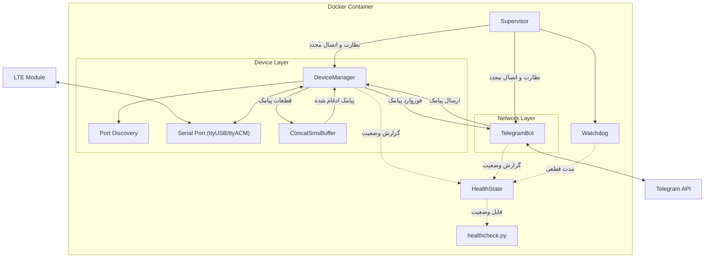

# SMS_forwarder_Telegram (EC200)

این پروژه پیامک‌های دریافتی توسط ماژول‌های ارتباطی GSM/LTE را به یک ربات تلگرام فوروارد می‌کند و همچنین از ارسال پیامک از طریق تلگرام پشتیبانی می‌کند.

## مستندات
[English](README.md) | [日本語](README_JP.md) | [简体中文](README_CN.md) | [فارسی](README_FA.md)

## ویژگی‌ها

- فوروارد خودکار پیامک‌های دریافتی به تلگرام
- پاسخ به پیامک از طریق تلگرام
- **ادغام خودکار پیامک‌های طولانی**: شناسایی و ادغام خودکار پیامک‌های چند بخشی برای اطمینان از دریافت متن کامل
- پشتیبانی از ماژول‌های رایج LTE (مانند سری EC200T/EC200S/EC200A)
- استقرار با Docker برای نصب و مدیریت آسان
- **کشف خودکار پورت**: سرویس خودش پورت AT ماژول را پیدا می‌کند و نیازی به تنظیم مسیر دستگاه نیست
- **انتظار برای سخت‌افزار**: می‌تواند پیش از کامل شدن شناسایی ماژول اجرا شود و به‌محض ظاهر شدن دستگاه متصل شود
- **بررسی سلامت سرویس**: نظارت، گزارش سلامت و واچ‌داگ با هم اجرای بدون سرپرست سرویس را تضمین می‌کنند

## معماری سیستم


```mermaid
graph TD
    subgraph DC [Docker Container]
        Sup[Supervisor]
        WD[Watchdog]
        HS[HealthState]
        HC["healthcheck.py"]

        subgraph DeviceLayer [Device Layer]
            DM[DeviceManager]
            Disc[Port Discovery]
            Serial["Serial Port (ttyUSB/ttyACM)"]
            Buffer[ConcatSmsBuffer]
        end

        subgraph NetworkLayer [Network Layer]
            Bot[TelegramBot]
        end
    end

    Hardware[LTE Module] <--> Serial
    Sup -- "نظارت و اتصال مجدد" --> DM
    Sup -- "نظارت و اتصال مجدد" --> Bot
    Sup --> WD
    DM --> Disc
    DM <--> Serial
    DM -- "قطعات پیامک" --> Buffer
    Buffer -- "پیامک ادغام شده" --> DM
    DM -- "فوروارد پیامک" --> Bot
    Bot -- "ارسال پیامک" --> DM
    Bot <--> API[Telegram API]

    DM -. "گزارش وضعیت" .-> HS
    Bot -. "گزارش وضعیت" .-> HS
    WD -. "مدت قطعی" .-> HS
    HS -. "فایل وضعیت" .-> HC
```

`Supervisor` دو مؤلفه مستقل را اداره می‌کند. هر مؤلفه جداگانه متصل و اجرا می‌شود و در صورت
خطا با تأخیر نمایی دوباره وصل می‌شود؛ هیچ‌کدام منتظر دیگری نمی‌ماند. یک مؤلفه تنها زمانی
بازیابی‌شده به حساب می‌آید که نشست آن به اندازه `SERVICE_STABLE_SECONDS` دوام آورده باشد،
بنابراین مؤلفه‌ای که وصل می‌شود و بی‌درنگ می‌افتد همچنان خراب دیده می‌شود. `HealthState`
این وضعیت را ثبت می‌کند، اگر چیزی بیش از `WATCHDOG_DOWN_SECONDS` قطع بماند واچ‌داگ فرایند
را خاتمه می‌دهد، و `healthcheck.py` همان وضعیت را به محیط اجرای کانتینر گزارش می‌کند.

## سخت‌افزار مورد نیاز

- ماژول‌های LTE پشتیبانی شده (همه موارد تایید نشده‌اند):
  - سری EC200T
  - سری EC200S
  - سری EC200A
  - EC200N-CN
  - سری EC600S
  - سری EC600N
  - سری EC800N
  - EG912Y-EU
  - EG915N-EU
  - سایر ماژول‌های GSM/LTE که از دستورات AT پشتیبانی می‌کنند
- کابل دیتای USB برای اتصال ماژول
- سرور/کامپیوتر لینوکس

## مراحل نصب

### 1. آماده‌سازی سخت‌افزار

1. سیم‌کارت را در ماژول LTE قرار دهید
2. ماژول را با کابل USB به میزبان لینوکس متصل کنید

### 2. تایید شناسایی دستگاه

پس از اتصال ماژول، لینوکس چندین دستگاه پورت سریال ایجاد می‌کند:

```bash
ls -l /dev/ttyUSB*
```

معمولاً چندین دستگاه (مثلاً ttyUSB0، ttyUSB1، ttyUSB2 و غیره) خواهید دید که تنها یکی از
آن‌ها دستورات AT را می‌پذیرد. **معمولاً لازم نیست خودتان تشخیص دهید کدام است**: سرویس هنگام
راه‌اندازی همه را امتحان می‌کند و آن که پاسخ دهد را نگه می‌دارد. به بخش «انتخاب پورت سریال»
مراجعه کنید.

با این حال خواندن این فهرست یک فایده دیگر هم دارد: دو عددی که پیش از تاریخ می‌آیند شماره
major و minor دستگاه هستند. شماره major تعیین می‌کند کانتینر به کدام قاعده
`device_cgroup_rules` نیاز دارد، و هر دو مقدار رایج (۱۸۸ برای `ttyUSB*` و ۱۶۶ برای
`ttyACM*`) از پیش در فایل نمونه استقرار وجود دارند.

### 3. جلوگیری از تداخل دستگاه

برخی از سرویس‌های سیستم ممکن است پورت سریال ماژول را اشغال کنند. اطمینان حاصل کنید که پورت در دسترس است:

```bash
# بررسی کنید که آیا سرویسی از پورت سریال استفاده می‌کند
lsof /dev/ttyUSB*

# غیرفعال کردن سرویس‌هایی که ممکن است تداخل ایجاد کنند (مانند ModemManager)
sudo systemctl stop ModemManager
sudo systemctl disable ModemManager
```

این مرحله از آنچه به نظر می‌رسد مهم‌تر است: کشف پورت، هر گزینه را به‌صورت انحصاری باز می‌کند
و از پورتی که فرایند دیگری در اختیار دارد عبور می‌کند؛ بنابراین یک مدیر مودم که پورت AT را
گرفته باشد، ماژول را برای این سرویس کاملاً نامرئی می‌کند.

### 4. ساخت ربات تلگرام خصوصی

1. در تلگرام، با [@BotFather](https://t.me/botfather) چت کنید تا یک ربات جدید بسازید
2. دستورالعمل‌ها را دنبال کنید تا فرآیند ساخت تکمیل شود و TOKEN ربات را دریافت کنید
3. شناسه کاربری تلگرام (CHAT_ID) خود را دریافت کنید:
   - برای دریافت آن با [@userinfobot](https://t.me/userinfobot) چت کنید
   - یا از طریق روش‌های دیگر برای ارسال پیام توسط ربات آن را دریافت کنید

برای آموزش دقیق، به [مستندات API ربات تلگرام](https://core.telegram.org/bots/api) مراجعه کنید

### 5. پیکربندی پروژه

1. ایمیج Docker را دریافت کنید. ایمیج `latest` از `linux/amd64` و `linux/arm64` پشتیبانی می‌کند:

```bash
docker pull vxhorse/sms-forwarder
```

2. فایل‌های پیکربندی محلی را از قالب‌های بدون اطلاعات حساس ایجاد کنید:

```bash
cp .env.example .env
cp docker-compose.example.yml docker-compose.yml
```

3. فایل `.env` را مطابق محیط واقعی خود ویرایش کنید.

تنها دو مقدار حتماً باید تغییر کنند:
- `BOT_TOKEN`: با Token ربات تلگرام خود جایگزین کنید
- `CHAT_ID`: با شناسه کاربری تلگرام خود جایگزین کنید

بقیه موارد مقدار پیش‌فرض کارآمد دارند:
- `SMS_PORT`: خالی بگذارید، مگر آنکه کشف خودکار دستگاه اشتباهی را انتخاب کند — به بخش «انتخاب پورت سریال» مراجعه کنید
- `PROXY_URL`: خالی یعنی اتصال مستقیم به API تلگرام؛ در صورت نیاز پروکسی خود را وارد کنید (مثلاً `http://127.0.0.1:7890`)
- در فایل استقرار هیچ مسیر دستگاهی لازم نیست — به بخش «چرا از `devices:` استفاده نمی‌کنیم» مراجعه کنید

### 6. راه‌اندازی سرویس

```bash
docker compose up -d
```

بالا آمدن آن را بررسی کنید:

```bash
docker compose ps          # وضعیت سلامت از starting به healthy می‌رسد
docker compose logs -f     # دنبال کردن روند راه‌اندازی
```

کانتینر تا سه دقیقه وضعیت `starting` را گزارش می‌کند و این طبیعی است: یک مؤلفه تنها پس از
آنکه اتصالش به اندازه `SERVICE_STABLE_SECONDS` دوام آورد بالا گزارش می‌شود، پس نخستین گزارش
سلامت زودتر از آن نمی‌رسد و ممکن است ماژول هنوز در حال شناسایی باشد.

## پیکربندی

### متغیرهای محیطی

همه تنظیمات از محیط خوانده می‌شوند و همه مقدار پیش‌فرض دارند. یک `.env` کارآمد فقط به
`BOT_TOKEN` و `CHAT_ID` نیاز دارد. واحد زمان‌ها ثانیه است.

| متغیر | پیش‌فرض | کاربرد |
| --- | --- | --- |
| `LOG_LEVEL` | `INFO` | سطح جزئیات لاگ |
| `SMS_PORT` | *(خالی)* | پورت AT ماژول. خالی یعنی کشف خودکار |
| `SMS_BAUDRATE` | `115200` | سرعت سریال |
| `SMS_DEV_ROOT` | `/dev` | مسیر پویش دستگاه‌ها. فایل استقرار آن را `/hostdev` می‌گذارد |
| `PORT_PROBE_TIMEOUT` | `3.0` | مهلت پاسخ `AT` برای هر پورت کاندید |
| `BOT_TOKEN` | *(جایگزین)* | توکن ربات تلگرام |
| `CHAT_ID` | *(جایگزین)* | چت تلگرامی که پیامک‌ها به آن فوروارد می‌شود |
| `PROXY_URL` | *(خالی)* | پروکسی خروجی برای API تلگرام. خالی یعنی اتصال مستقیم |
| `NOTIFY_TIMEOUT` | `5.0` | مهلت یک اعلان وضعیت. محدود به بازه ۱ تا ۱۰ |
| `RECONNECT_BACKOFF_MIN` | `1.0` | کمترین فاصله میان تلاش‌های اتصال مجدد |
| `RECONNECT_BACKOFF_MAX` | `30.0` | بیشترین فاصله میان تلاش‌های اتصال مجدد |
| `SERVICE_STABLE_SECONDS` | `60.0` | مدت دوام نشست تا بازیابی به حساب آید. کف آن ۵ است |
| `MODEM_PROBE_INTERVAL` | `30.0` | فاصله بررسی زنده‌بودن. حداکثر نیمی از `HEALTH_STALE_SECONDS` |
| `MODEM_PROBE_TIMEOUT` | `5.0` | مهلت پاسخ ماژول به هر بررسی |
| `MODEM_PROBE_FAILURES` | `3` | تعداد بررسی‌های پیاپی ناموفق تا اتصال مجدد |
| `AT_COMMAND_TIMEOUT` | `3.0` | مهلت یک دستور AT |
| `AT_SLOW_COMMAND_TIMEOUT` | `10.0` | مهلت دستورات کند (`AT&F`، `AT+CFUN`، `AT&W`) |
| `HEALTH_FILE` | `/tmp/healthy` | فایل وضعیتی که بررسی سلامت می‌خواند |
| `HEALTH_STALE_SECONDS` | `120` | حداکثر کهنگی مجاز آن فایل. کف آن ۲ است |
| `WATCHDOG_DOWN_SECONDS` | `3600` | خروج پس از این مدت قطعی یک مؤلفه |
| `WATCHDOG_CHECK_INTERVAL` | `30.0` | فاصله بررسی واچ‌داگ. کف آن ۱ است |

### انتخاب پورت سریال

`SMS_PORT` می‌تواند خالی بماند. سرویس هنگام راه‌اندازی پورت‌های سریال کاندید را پویش می‌کند
و نخستین پورتی را نگه می‌دارد که به `AT` با `OK` پاسخ دهد:

1. `$SMS_DEV_ROOT/serial/by-id/*` — شناسه‌های پایدار، اول امتحان می‌شوند
2. `$SMS_DEV_ROOT/ttyUSB*`
3. `$SMS_DEV_ROOT/ttyACM*`

پورت‌های سریال داخلی (`ttyS*`) هرگز بررسی نمی‌شوند، چون روی بسیاری از بردها `ttyS0`
کنسول کرنل است.

این موضوع اهمیت دارد چون ماژول‌های این دسته چند پورت سریال ارائه می‌کنند و تنها یکی از
آن‌ها دستورات AT را می‌پذیرد. `SMS_PORT` را فقط در صورتی صریح تنظیم کنید که بیش از یک
ماژول دارید یا دستگاه شما در مسیری غیرمعمول است.

اگر آن را تنظیم می‌کنید، مسیر را همان‌طور بنویسید که سرویس می‌بیند. با فایل استقرار این
مخزن، مسیر `/dev` میزبان روی `/hostdev` سوار می‌شود، پس پورت `/hostdev/ttyUSB2` است،
نه `/dev/ttyUSB2`.

### چرا از `devices:` استفاده نمی‌کنیم

فایل استقرار به‌جای نگاشت `devices:`، مسیر `/dev` را bind mount می‌کند و دسترسی را از راه
`device_cgroup_rules` می‌دهد.

یک ورودی `devices:` هنگام **ساخت** کانتینر تفسیر می‌شود. اگر دستگاه در آن لحظه موجود نباشد،
ساخت شکست می‌خورد، کانتینر هرگز وارد حالت اجرا نمی‌شود و سیاست راه‌اندازی مجدد هم اعمال
نمی‌شود — چون این سیاست فقط کانتینرهایی را پوشش می‌دهد که اجرا شده و سپس خارج شده‌اند.
روی ماشینی که سریع بالا می‌آید، به‌راحتی ممکن است محیط اجرای کانتینر پیش از پایان شناسایی
مودم USB شروع شود و کانتینر تا وقتی کسی دستی آن را راه بیندازد خاموش بماند.

با bind mount، ساخت کانتینر دیگر به دستگاه وابسته نیست. دستگاهی که بعداً پیدا شود به‌طور
خودکار داخل کانتینر هم دیده می‌شود و سرویس با تأخیر نمایی منتظر آن می‌ماند.

اگر مودم شما دستگاه سریال USB (major 188) نیست بلکه CDC-ACM (major 166) است، هر دو از پیش
مجاز شده‌اند. با `ls -l /dev/ttyUSB*` یا `ls -l /dev/ttyACM*` بررسی کنید.

## راهنمای استفاده

پس از راه‌اندازی سرویس، به طور خودکار پیامک‌های دریافتی را نظارت کرده و به مکالمه تلگرام پیکربندی شده فوروارد می‌کند.

### ارسال پیامک از طریق تلگرام

در چت ربات تلگرام:

1. از دستور `/sendsms` برای شروع فرآیند ارسال استفاده کنید
2. طبق دستور شماره تلفن مقصد را وارد کنید
3. طبق دستور متن پیامک را وارد کنید
4. پس از ارسال پیامک تاییدیه دریافت خواهید کرد

### مشاهده راهنما

در چت ربات تلگرام `/help` را ارسال کنید تا تمام دستورات موجود را مشاهده کنید.

## نکات

- **پشتیبانی از پیامک طولانی**: این سرویس از ادغام خودکار پیامک‌های طولانی پشتیبانی می‌کند. پیام‌های چند بخشی تا 60 ثانیه منتظر دریافت تمام بخش‌ها می‌مانند تا ادغام و فوروارد شوند.
- **سازگاری**: مدل‌های مختلف ماژول سازگاری متفاوتی دارند؛ برخی ماژول‌ها ممکن است از ارسال و دریافت پیامک‌های متنی طولانی پشتیبانی نکنند
- **پایداری**: هر مؤلفه خودش با تأخیر نمایی دوباره وصل می‌شود و اگر چیزی بیش از `WATCHDOG_DOWN_SECONDS` قطع بماند، واچ‌داگ فرایند را از نو راه می‌اندازد
- **انتخاب پورت سریال**: `SMS_PORT` را خالی بگذارید تا کشف خودکار انتخاب کند. فقط وقتی دستگاه اشتباهی انتخاب می‌شود آن را تنظیم کنید و مسیر را زیر `SMS_DEV_ROOT` بدهید
- **نبودن سخت‌افزار خطا نیست**: بدون مودم متصل، سرویس بی‌وقفه منتظر می‌ماند و تلاش را تکرار می‌کند؛ در این مدت کانتینر ناسالم گزارش می‌شود
- **تشخیص سیم‌کارت**: اطمینان حاصل کنید که سیم‌کارت به درستی وارد شده و شارژ کافی دارد
- **وابستگی به شبکه**: ارتباط تلگرام نیاز به اتصال شبکه پایدار دارد
- **تنظیمات فایروال**: اطمینان حاصل کنید که سرور اجازه اتصال شبکه به API تلگرام را می‌دهد

## عیب‌یابی

1. **عدم امکان ارسال/دریافت پیامک**:
   - در لاگ ببینید کدام پورت کشف شده است: `docker compose logs | grep -i port`
   - وضعیت سیم‌کارت (سیگنال، شارژ) را تایید کنید
   - بررسی لاگ‌ها: `docker logs sms-forwarder`

2. **مشکلات ارتباطی تلگرام**:
   - پیکربندی TOKEN و CHAT_ID را تایید کنید
   - اتصال شبکه و تنظیمات پروکسی را بررسی کنید
   - تایید کنید تنظیمات دسترسی ربات صحیح است

3. **عدم شناسایی ماژول**:
   - تایید کنید میزبان دستگاه را می‌بیند: `ls -l /dev/ttyUSB*` و `dmesg | grep tty`
   - اگر میزبان آن را می‌بیند ولی کانتینر نه، بررسی کنید شماره major در فهرست، در `device_cgroup_rules` پوشش داده شده باشد
   - پس از اتصال ماژول لازم نیست چیزی راه‌اندازی مجدد شود: سرویس منتظر آن است و خودش آن را برمی‌دارد
