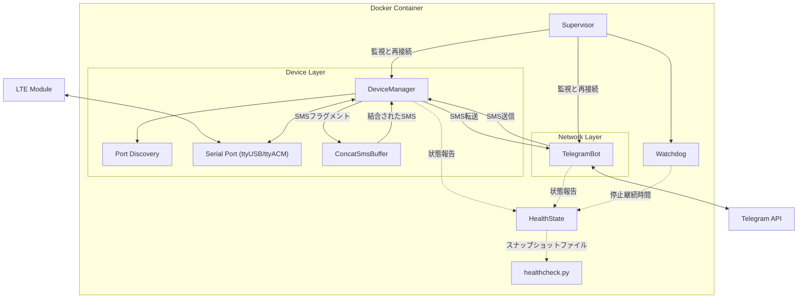

# SMS_forwarder_Telegram (EC200)

このプロジェクトはGSM/LTE通信モジュールが受信したSMSをTelegramボットに転送し、Telegramを通じてSMSを送信する機能もサポートします。

## ドキュメント
[English](README.md) | [日本語](README_JP.md) | [简体中文](README_CN.md) | [فارسی](README_FA.md)

## 機能特徴

- 受信したSMSを自動的にTelegramに転送
- Telegramを通じてSMSに返信
- **長文SMS自動結合**：分割されたSMSを自動的に識別・結合し、完全なテキストを確実に受信
- 主流のLTEモジュール（EC200T/EC200S/EC200Aなどのシリーズ）をサポート
- Dockerデプロイメントで簡単にインストールと管理が可能
- **ポートの自動検出**：モジュールのATポートを自ら探索するため、デバイスパスの設定は不要
- **ハードウェアを待機**：モジュールの列挙が完了する前に起動でき、デバイスが現れ次第接続
- **サービスヘルスチェック**：監視・ヘルス報告・ウォッチドッグにより無人での安定稼働を保証

## システムアーキテクチャ



`Supervisor` は独立した2つのコンポーネントを駆動します。各コンポーネントはそれぞれ接続・実行し、
失敗すると指数バックオフで再接続します。互いの完了を待つことはありません。
セッションが `SERVICE_STABLE_SECONDS` の間持続して初めて復旧とみなされるため、
接続直後に失敗を繰り返すコンポーネントは故障として扱われ続けます。
`HealthState` がその状態を記録し、コンポーネントが失われる2通りのいずれか——
`WATCHDOG_DOWN_SECONDS` を超えて停止したまま、または稼働中と報告しながらループが
`WATCHDOG_STALL_SECONDS` の間進まないまま——でウォッチドッグがプロセスを終了させ、
`healthcheck.py` が同じ状態をコンテナランタイムへ報告します。

## ハードウェア要件

- サポート可能なLTEモジュール（すべて検証済みではありません）：
  - EC200Tシリーズ
  - EC200Sシリーズ
  - EC200Aシリーズ
  - EC200N-CN
  - EC600Sシリーズ
  - EC600Nシリーズ
  - EC800Nシリーズ
  - EG912Y-EU
  - EG915N-EU
  - その他AT命令をサポートするGSM/LTEモジュール
- モジュール接続用USBデータケーブル
- Linuxが稼働するサーバー/コンピュータ

## インストール手順

### 1. ハードウェアの準備

1. SIMカードをLTEモジュールに挿入
2. USBデータケーブルでモジュールをLinuxホストに接続

### 2. デバイス認識の確認

モジュール接続後、Linuxは複数のシリアルポートデバイスを作成します：

```bash
ls -l /dev/ttyUSB*
```

通常、複数のデバイス（例：ttyUSB0、ttyUSB1、ttyUSB2など）が表示されますが、
AT命令を受け付けるのはそのうち1つだけです。
**どれかを自分で特定する必要は通常ありません**：サービスは起動時に各ポートを試し、
応答したものを採用します。詳細は「シリアルポートの選択」の節を参照してください。

ただしこの一覧にはもう1つ読む価値があります。日付の前にある2つの数字はデバイスの
メジャー番号とマイナー番号です。メジャー番号によってコンテナに必要な
`device_cgroup_rules` の項目が決まり、よく使われる2つ（`ttyUSB*` は188、
`ttyACM*` は166）はサンプルの構成ファイルにすでに含まれています。

### 3. デバイス競合の回避

一部のシステムサービスがモジュールのシリアルポートを占有している可能性があるため、ポートが利用可能であることを確認してください：

```bash
# シリアルポートを占有しているサービスを確認
lsof /dev/ttyUSB*

# 干渉する可能性のあるサービス（ModemManagerなど）を無効化
sudo systemctl stop ModemManager
sudo systemctl disable ModemManager
```

これは見た目以上に重要です。ポート検出は候補を排他モードで開き、
他のプロセスが保持しているポートは飛ばすため、ATポートを掴んだままの
モデムマネージャーがあると、モジュールは本サービスから完全に見えなくなります。

### 4. プライベートTelegramボットの作成

1. Telegramで[@BotFather](https://t.me/botfather)と対話して新しいボットを作成
2. 指示に従って作成プロセスを完了し、ボットのTOKENを取得
3. あなたのTelegramユーザーID (CHAT_ID)を取得：
   - [@userinfobot](https://t.me/userinfobot)と対話して取得
   - または他のCHAT_ID取得ボットを使用

詳細なチュートリアルは[Telegram Bot APIドキュメント](https://core.telegram.org/bots/api)を参照してください

### 5. プロジェクトの設定

1. Dockerイメージを取得します。`latest` イメージは `linux/amd64` と `linux/arm64` をサポートしています：

```bash
docker pull vxhorse/sms-forwarder
```

本リポジトリから自分でビルドすることもできます。クローンした直後は通常こちらです：

```bash
docker build -t sms-forwarder .
```

自分でビルドした場合は、`docker-compose.yml` の `image:` を `sms-forwarder` に設定してください。

2. サニタイズ済みテンプレートからローカル設定ファイルを作成します：

```bash
cp .env.example .env
cp docker-compose.example.yml docker-compose.yml
```

3. 実際の環境に合わせて `.env` を編集します。

変更が必要なのは次の2つだけです：
- `BOT_TOKEN`: あなたのTelegramボットTokenに置き換え
- `CHAT_ID`: あなたのTelegramユーザーIDに置き換え

その他はすべて実用的な既定値を持ちます：
- `SMS_PORT`: 自動検出が誤ったデバイスを選ぶ場合を除き、空のままにします。詳細は「シリアルポートの選択」の節を参照
- `PROXY_URL`: 空ならTelegram APIへ直接接続します。必要な場合のみプロキシを設定（例：`http://127.0.0.1:7890`）
- 構成ファイルにデバイスパスを書く必要は一切ありません。詳細は「`devices:` を使わない理由」の節を参照

### 6. サービスの起動

```bash
docker compose up -d
```

起動を確認します：

```bash
docker compose ps          # ヘルス状態が starting から healthy に変わります
docker compose logs -f     # 起動シーケンスを追跡します
```

コンテナは最大3分間 `starting` を報告しますが、これは正常です。
各ヘルス状態の意味と確認方法は「ヘルスチェックの読み方」の節を参照してください。

## 設定

### 環境変数

すべての設定は環境変数から読み込まれ、すべてに既定値があります。実用的な `.env` に
必要なのは `BOT_TOKEN` と `CHAT_ID` だけです。時間の単位は秒です。

| 変数 | 既定値 | 用途 |
| --- | --- | --- |
| `LOG_LEVEL` | `INFO` | ログの詳細度 |
| `SMS_PORT` | *(空)* | モジュールのATポート。空なら自動検出 |
| `SMS_BAUDRATE` | `115200` | シリアル速度 |
| `SMS_DEV_ROOT` | `/dev` | 走査するデバイスツリー。構成ファイルでは `/hostdev` |
| `PORT_PROBE_TIMEOUT` | `3.0` | 候補ポートが `AT` に応答する制限時間 |
| `BOT_TOKEN` | *(プレースホルダ)* | TelegramボットToken |
| `CHAT_ID` | *(プレースホルダ)* | 転送先のTelegramチャット |
| `PROXY_URL` | *(空)* | Telegram API向けの送信プロキシ。空なら直接接続 |
| `NOTIFY_TIMEOUT` | `5.0` | 状態通知1回の制限時間。1〜10に制限されます |
| `RECONNECT_BACKOFF_MIN` | `1.0` | 再接続待機の最小値 |
| `RECONNECT_BACKOFF_MAX` | `30.0` | 再接続待機の最大値 |
| `SERVICE_STABLE_SECONDS` | `60.0` | 復旧とみなすまでのセッション継続時間。下限は5 |
| `MODEM_PROBE_INTERVAL` | `30.0` | 死活監視の間隔。`HEALTH_STALE_SECONDS` の半分が上限 |
| `MODEM_PROBE_TIMEOUT` | `5.0` | モジュールが監視に応答する制限時間 |
| `MODEM_PROBE_FAILURES` | `3` | 再接続を強制する連続失敗回数 |
| `MODEM_REGISTRATION_CHECK` | `0` | モジュールが在圏しているかも問い合わせるか。既定は無効——[在圏確認](#在圏確認)を参照 |
| `MODEM_REGISTRATION_FAILURES` | `3` | 上記を有効にした場合、再接続を強制する「圏外」の連続読み取り回数。下限は2 |
| `AT_COMMAND_TIMEOUT` | `3.0` | AT命令1回の制限時間 |
| `AT_SLOW_COMMAND_TIMEOUT` | `10.0` | 低速な命令（`AT&F`、`AT+CFUN`、`AT&W`）の制限時間 |
| `SERIAL_CLOSE_TIMEOUT` | `5.0` | シリアルポート解放時にバッファを吐き出せる時間。超えると強制的に閉じます。下限は1 |
| `HEALTH_FILE` | `/tmp/healthy` | ヘルスチェックが読むスナップショットファイル |
| `HEALTH_STALE_SECONDS` | `120` | そのスナップショットが古いとみなされるまでの時間。下限は2 |
| `WATCHDOG_DOWN_SECONDS` | `3600` | コンポーネント停止がこの時間を超えたら終了 |
| `WATCHDOG_STALL_SECONDS` | *(導出値)* | どのループも進まない状態がこの時間続いたら終了。既定は `HEALTH_STALE_SECONDS` の2倍で、導出された下限（既定構成では約310）まで引き上げられ、`WATCHDOG_DOWN_SECONDS` が上限 |
| `WATCHDOG_CHECK_INTERVAL` | `30.0` | ウォッチドッグの確認間隔。下限は1 |

### シリアルポートの選択

`SMS_PORT` は空のままで構いません。起動時にサービスは候補となるシリアルポートを走査し、
`AT` に `OK` で応答した最初のポートを採用します：

1. `$SMS_DEV_ROOT/serial/by-id/*` —— 識別子が安定しており最優先
2. `$SMS_DEV_ROOT/ttyUSB*`
3. `$SMS_DEV_ROOT/ttyACM*`

オンボードのシリアルポート（`ttyS*`）は決して探索しません。多くのボードで
`ttyS0` はカーネルコンソールだからです。

これが重要なのは、この種のモジュールが複数のシリアルポートを公開し、
AT命令を受け付けるのはそのうち1つだけだからです。`SMS_PORT` を明示するのは、
モジュールを複数接続している場合か、デバイスが通常と異なる場所にある場合だけにしてください。

明示する場合は、サービスから見えるパスを書いてください。本リポジトリの構成ファイルでは
ホストの `/dev` が `/hostdev` にマウントされるため、ポートは `/dev/ttyUSB2` ではなく
`/hostdev/ttyUSB2` になります。

### 在圏確認

死活監視が示すのはモジュールが応答することだけで、SMSが届くことまでは示しません。
ネットワークから切り離されたSIMは、以前とまったく同じようにすべての命令へ応答しながら、
SMSは1通も届きません。`MODEM_REGISTRATION_CHECK=1` は2つ目の問い `AT+CREG?` を加え、
「圏外」を示す読み取りが `MODEM_REGISTRATION_FAILURES` 回続いた時点でセッションを終了します。

既定では**無効**です。この問いは、すべてのネットワークで真の答えを持つわけではないからです。
`+CREG` が表すのは回線交換ドメインであり、モジュールをパケットサービスのためだけに
在圏させるネットワーク——SMSはそのドメインが表せない経路で届く——では、
すべてが正常に動作している最中に「圏外」と報告します。それに反応すれば、
正常なセッションを数分ごとに終了させ、そのたびに無線を初期化し直し
（本当の障害からの復帰はかえって長引きます）、周期ごとにモジュールの保存設定を書き換えます。
この繰り返しは外からも見えにくいものです。失敗として上がるのはセッションが復旧と
みなされる時点より後なので、周期ごとにウォッチドッグの測定値がリセットされ、
スナップショットが古くなるのは切断処理の間だけなので、コンテナのヘルスチェックは
その間も緑のままです。

確かめるまで無効のままにしても、診断上の情報は何も失われません。起動処理で
モジュールに在圏状態の変化を自発的に報告させているため、有効・無効にかかわらず
状態は解析され、スナップショットに載り、ログにも残ります。先送りされるのは
「それを理由にセッションを終了するか」だけです。通常のSMSのやり取りを含む期間にわたって
`registration` フィールドを見てください：

```bash
docker compose exec sms-forwarder cat /tmp/healthy
```

- `1`、`5`、`6`、`7` のいずれかで安定する（自局在圏、ローミング在圏、
  またはそれぞれのSMS限定の在圏）——このネットワークでは問いに真の答えがあり、
  `MODEM_REGISTRATION_CHECK=1` が本来の検知能力をもたらします。
- SMSが届き続けているのに `0` や `2` のまま——これがこの確認では表せない
  ネットワークです。無効のままにしてください。

完全な答えに何が必要かは [`doc/README.md`](doc/README.md) に記録しています。

### `devices:` を使わない理由

構成ファイルは `devices:` マッピングを使わず、`/dev` をバインドマウントして
`device_cgroup_rules` でアクセスを許可します。

`devices:` の項目はコンテナの**作成時**に解決されます。その瞬間にデバイスが存在しなければ
作成そのものが失敗し、コンテナは実行状態に入らず、再起動ポリシーも適用されません
—— 再起動ポリシーは、一度実行されてから終了したコンテナだけを対象とするからです。
起動の速いマシンでは、USBモジュールの列挙が終わる前にコンテナランタイムが起動することは
容易に起こり、その場合コンテナは誰かが手動で起動するまで停止したままになります。

バインドマウントであれば、コンテナの作成はデバイスに依存しません。後から現れたデバイスは
自動的にコンテナ内にも現れ、サービスは指数バックオフでそれを待ちます。

モジュールがUSBシリアルデバイス（メジャー188）ではなくCDC-ACM（メジャー166）であっても、
どちらもすでに許可されています。`ls -l /dev/ttyUSB*` または `ls -l /dev/ttyACM*` で確認してください。

### ヘルスチェックの読み方

`healthcheck.py` が答えるのは1つの問いだけです——このプロセスは今SMSを転送できるか。
「できる」と答えるには次の2つが同時に成り立つ必要があります：

1. `HEALTH_FILE` のスナップショットファイルが `HEALTH_STALE_SECONDS` 以内に
   書かれていること。プロセスが各ループを回し続けている証拠になります。
2. そのファイルに記録されたすべてのコンポーネントが稼働中であること。
   モジュールとTelegram APIの両方に到達できる証拠になります。

このファイルは全コンポーネントが稼働中のときにだけ書かれ、各コンポーネントが
自分のループから更新します。したがってプロセスが止まれば更新も止まり、
残されたファイルは自然に古くなります。新しいだけ、あるいは存在するだけでは
健全とはみなされません。

コンテナランタイムの現在の判断を確認します：

```bash
docker inspect --format '{{.State.Health.Status}}' sms-forwarder
docker inspect --format '{{json .State.Health.Log}}' sms-forwarder
```

同じ検査を手動で実行して終了コードを読むこともできます——`0` は健全、`1` は不健全です：

```bash
docker compose exec sms-forwarder python /app/healthcheck.py; echo $?
```

見分けておく価値のある状態は3つです：

- **`starting`**——`start_period` の範囲内です。サンプルの構成ファイルでは180秒です。
  コンポーネントはセッションが `SERVICE_STABLE_SECONDS`（既定60秒）持続して初めて
  稼働中と報告され、スナップショットは全コンポーネントが稼働中になるまで書かれないため、
  最初の書き込みはどんなに早くても両者の接続から1分後です。`start_period` はその時間に
  モジュールの列挙時間を足した分をカバーする必要があります。遅いモジュールなら大きくしてください。
- **`unhealthy`**——SMSは一切転送されていません。これ自体は何も再起動しないことに
  注意してください。コンテナランタイムは記録するだけです。復旧はサービス自身の再接続か、
  それが効かない場合はウォッチドッグがプロセスを終了させ、あとは再起動ポリシーが
  引き継ぎます。ウォッチドッグの終了経路は2つあり、桁が1つ違います：
  - **はっきり失敗した**コンポーネントは停止として記録され、その状態が
    `WATCHDOG_DOWN_SECONDS`（既定で1時間）続くとプロセスが終了します。ログは
    `Watchdog tripped: a component has been down for ...` です。
  - **失敗せずに固まった**コンポーネントは稼働中のままなので、上の計測は始まりません。
    これを捕まえるのは `WATCHDOG_STALL_SECONDS` です。どのループも進捗を報告せず、
    スナップショットも書かれない状態がその時間続いた、という意味です。既定構成では
    1時間ではなく**約310秒**なので、静かになってからおよそ5分後の説明のつかない
    再起動はこちらであって、もう一方ではありません。ログは
    `Watchdog tripped: nothing has made progress for ...` で、
    `HEALTH_FILE` が書けない場合もこれに該当します。
- **`healthy`**——スナップショットが新しく、かつ全コンポーネントが稼働中です。

## 使用方法

サービス起動後、自動的にSMSを監視し、設定されたTelegramチャットに転送します。

### Telegramを通じてSMSを送信

Telegramボットとの対話で：

1. `/sendsms`コマンドで送信プロセスを開始
2. 指示に従って宛先の電話番号を入力
3. 指示に従ってSMS内容を入力
4. SMS送信後に確認通知が届きます

### ヘルプの確認

Telegramボットとの対話で`/help`を送信して、利用可能なすべてのコマンドを確認できます。

## 注意事項

- **長文SMSサポート**：本サービスは長文SMSの自動結合に対応しており、分割されたSMSは60秒以内にすべての断片が到着するのを待って結合・転送されます
- **互換性**：異なるモデルのモジュールの互換性は異なり、一部のモジュールは長文SMSの送受信をサポートしていない場合があります
- **安定性**：各コンポーネントは指数バックオフで自律的に再接続し、`WATCHDOG_DOWN_SECONDS` を超えて停止したまま、または稼働中と報告しながら `WATCHDOG_STALL_SECONDS` の間進捗がないままならウォッチドッグがプロセスを再起動します
- **シリアルポートの選択**：まずは `SMS_PORT` を空にして自動検出に任せてください。誤ったデバイスが選ばれる場合のみ設定し、`SMS_DEV_ROOT` 配下のパスを指定します
- **ハードウェアがなくてもエラーではありません**：モジュール未接続なら、サービスは無期限に待機して再試行し、その間コンテナは不健全と報告されます
- **SIMカードの検出**：SIMカードが正しく挿入され、十分な残高があることを確認してください
- **ネットワーク依存**：Telegram通信には安定したネットワーク接続が必要です
- **ファイアウォール設定**：サーバーがTelegram APIのネットワーク接続を許可していることを確認してください

## トラブルシューティング

1. **SMSの送受信ができない**：
   - どのポートが検出されたかをログで確認：`docker compose logs | grep -i port`
   - SIMカードの状態（信号、残高があるか）を確認
   - ログを確認：`docker logs sms-forwarder`

2. **Telegram通信の問題**：
   - TOKENとCHAT_IDの設定を検証
   - ネットワーク接続とプロキシ設定を確認
   - ボットの権限設定が正しいことを確認

3. **モジュールが認識されない**：
   - まず自動検出が何を報告したかを読みます：`docker compose logs | grep -iE 'candidate|discovered|answered'`。
     `Discovered modem AT port: ...` は成功、`No candidate port answered AT` は
     候補をすべて試したがどれも応答しなかったこと、`No candidate serial ports under ...`
     はそもそも試す対象が無かったことを意味します
   - ホストがデバイスを認識しているか確認：`ls -l /dev/ttyUSB*` と `dmesg | grep tty`
   - ホストからは見えてコンテナから見えない場合、一覧のメジャー番号が `device_cgroup_rules` に含まれているか確認
   - 候補を試したのにどれも応答しない場合、最も多い原因は他のプロセスがATポートを掴んでいることです。
     「デバイス競合の回避」の節を参照してください
   - モジュールのATポートが `ttyUSB*` でも `ttyACM*` でもない場合、探索の対象になりません。
     `SMS_PORT` を明示し、`SMS_DEV_ROOT` 配下のパスで指定してください
   - モジュールを挿した後に何かを再起動する必要はありません：サービスは待機しており、自動的に接続します

4. **本プロジェクトで検証していないモジュール**：
   - 初期化シーケンスのうち2つはベンダー固有の命令です（`AT+QCFG`、`AT+QURCCFG`）。
     これらを実装しないモジュールは `... was not acknowledged; continuing setup` を
     記録して処理を続けます。これは無害です
   - 必須なのは4つだけです：`AT+CFUN=1`、`AT+CMGF=0`、`AT+CPMS`、`AT+CNMI`。
     `Modem did not acknowledge <command>` の後に再接続が続く場合、そのいずれかが拒否されており、
     そのモジュールは現状のままでは駆動できません
   - [`doc/README.md`](doc/README.md) にサービスが発行する全命令とその用途をまとめてあるので、
     お使いのモジュールのATコマンドマニュアルで1つずつ照合できます

5. **コンテナがいつまでも healthy にならない**：
   - 最大3分の `starting` は正常です。「ヘルスチェックの読み方」の節を参照してください
   - `unhealthy` のままならコンポーネントが停止しています。どれかはログが示します：
     `Component <name> failed ...`
   - 不健全であることを理由にコンテナランタイムが再起動することはありません。
     ウォッチドッグがプロセスを終了させます——失敗したコンポーネントなら
     `WATCHDOG_DOWN_SECONDS` の後、失敗せずに進まなくなったコンポーネントなら
     はるかに短い `WATCHDOG_STALL_SECONDS` の後です——あとは再起動ポリシーが
     引き継ぎます。どちらかは
     `docker compose logs | grep 'Watchdog tripped'` で分かります
